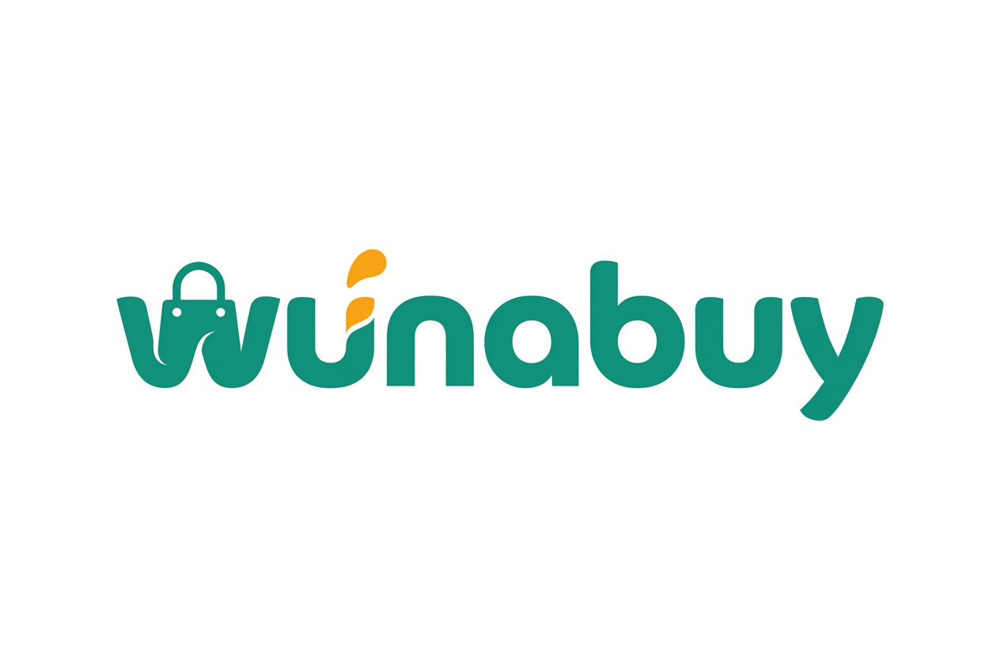

<p align="center">
  
</p>

<h3 align="center">Multi-Sided E-Commerce & On-Demand Logistics Marketplace</h3>

<p align="center">
  <em>Escrow-protected commerce built for emerging African markets</em>
</p>

<p align="center">
  
  
  
  
  
  
</p>

---

## 🌍 About Wunabuy

Wunabuy is an enterprise multi-sided mobile e-commerce and on-demand logistics platform designed specifically for emerging African markets, launching first in **Yaoundé, Cameroon**.

It connects three user groups through a single escrow-protected ecosystem:

| Role | What They Do |
|---|---|
| 🛒 **Buyers** | Search verified stores, purchase with escrow protection, track deliveries in real-time |
| 🏪 **Sellers (Store Owners)** | Digitize storefronts, manage inventory, receive guaranteed payouts after verified delivery |
| 🚚 **Transport Providers** | Accept delivery jobs, navigate with GPS, earn transparent mileage-based fees |

An internal **Staff Portal** provides operational dashboards across 6 departments (Finance, IT, Customer Service, Operations, Compliance, Marketing) with strict RBAC and MFA.

### Core Value Propositions

- **Escrow-Protected Payments** — Buyer funds are locked until delivery is confirmed via photo proof + buyer digital signature. 48-hour auto-release with dispute protection.
- **3.5% Platform Commission** — Transparent, configurable marketplace fee deducted before seller wallet credit.
- **Real-Time GPS Tracking** — Live transporter location updates every 10 seconds via Laravel Reverb WebSockets.
- **Offline-Resilient Design** — Built for spotty 3G/4G in African urban markets with queued background sync.
- **Multi-Language** — English, French, and Swahili support (Phase 1).

---

## 📁 Repository Structure

```
wunabuy/
├── backend/                   # Laravel 13 Modular Monolith (PHP 8.3+)
│   ├── app/                   # Core Service Providers & Middleware
│   ├── Modules/               # nwidart/laravel-modules (Auth, Commerce, Payment, Delivery, etc.)
│   ├── config/                # Horizon, Reverb, Sanctum, Permissions configuration
│   ├── database/              # PostgreSQL + PostGIS Migrations & Seeders
│   └── routes/                # API v1 & Reverb WebSocket channel routes
│
├── mobile/                    # Expo React Native App (iOS & Android)
│   ├── src/
│   │   ├── components/        # Shared design system UI components
│   │   ├── features/          # Feature modules (auth, product, cart, order, delivery, chat)
│   │   ├── navigation/        # Role-based navigators (Buyer, Seller, Transporter)
│   │   ├── stores/            # Zustand client state stores
│   │   ├── i18n/              # Internationalization (EN, FR, SW)
│   │   └── services/          # Offline sync, push notifications, location
│   ├── app.json               # Expo SDK 51 configuration
│   └── package.json
│
├── staff-portal/              # React Web Staff Portal (Vite 5 + shadcn/ui + Tailwind CSS)
│   ├── src/
│   │   ├── layouts/           # Dashboard shell, sidebar, header
│   │   └── pages/             # Department dashboards (Finance, Ops, CS, Compliance, IT, Marketing)
│   ├── vite.config.ts
│   └── package.json
│
├── packages/                  # Shared Monorepo Packages
│   ├── design-tokens/         # Brand palette, typography, spacing, dark/light themes
│   ├── types/                 # Shared TypeScript API contracts & domain interfaces
│   ├── api-client/            # Axios instance with Sanctum token refresh interceptors
│   ├── realtime/              # Laravel Reverb Echo WebSocket subscriptions
│   └── utils/                 # XAF currency formatting, date, phone, geo helpers
│
├── docs/                      # Architecture & Product Specifications
│   ├── assets/                # Brand assets (logo, icons)
│   ├── Wunabuy_PRD_v1.0.md
│   ├── Wunabuy_SRS_v1.2.md
│   ├── Wunabuy_Backend_Tech_Spec_v1.0.md
│   ├── Wunabuy_Frontend_Tech_Spec_v1.0.md
│   └── Wunabuy_Backend_API_Contract_v1.0.md
│
├── .github/
│   └── workflows/             # CI/CD Pipelines
│       ├── backend-ci.yml     # PHP 8.3 + PostgreSQL + Redis test suite
│       ├── mobile-ci.yml      # TypeScript typecheck + Jest tests
│       └── staff-portal-ci.yml # Vite build + Vitest tests
│
├── pnpm-workspace.yaml        # Monorepo workspace config
├── turbo.json                 # Turborepo build cache pipeline
├── tsconfig.base.json         # Shared TypeScript base config
├── package.json               # Root monorepo scripts
├── CONTRIBUTING.md
├── LICENSE                    # MIT
└── README.md
```

---

## 🛠 Technology Stack

### Mobile App (Buyer / Seller / Transporter)

| Layer | Technology |
|---|---|
| Framework | React Native 0.74+ / Expo SDK 51 (Hermes engine) |
| Navigation | React Navigation 6.x (Native Stack, Bottom Tabs, Drawer) |
| Client State | Zustand 4.x (persisted to AsyncStorage) |
| Server State | TanStack React Query 5.x |
| Networking | Axios 1.x with Sanctum Bearer token interceptors |
| Real-Time | `laravel-echo` + `pusher-js` → Laravel Reverb WebSockets |
| Maps & GPS | `react-native-maps` + `expo-location` (background tracking) |
| Secure Storage | `react-native-keychain` (hardware-backed keystore) |
| Images | `expo-image` (BlurHash placeholders) + `expo-image-manipulator` |
| Push Notifications | `@react-native-firebase/messaging` + `notifee` |
| i18n | `i18next` + `react-i18next` (EN, FR, SW) |
| Animations | React Native Reanimated 3.x + Moti |
| Lists | `@shopify/flash-list` (recycling virtualized lists) |

### Staff Portal (Internal Operations)

| Layer | Technology |
|---|---|
| Framework | React 18 + Vite 5 |
| Routing | TanStack Router |
| UI Components | shadcn/ui (Radix UI primitives) + Tailwind CSS 3.x |
| Data Tables | TanStack Table v8 + `@tanstack/react-virtual` |
| Charts | Recharts 2.x |
| Forms | `react-hook-form` + `zod` |

### Backend (Managed by Backend Team)

| Layer | Technology |
|---|---|
| Framework | Laravel 13 (PHP 8.3+) |
| Auth | Laravel Sanctum (opaque Bearer tokens) + TOTP MFA (Staff) |
| Database | PostgreSQL 15 + PostGIS spatial extensions |
| Queues | Laravel Horizon + Redis 7 |
| WebSockets | Laravel Reverb |
| Storage | Laravel Flysystem (S3-compatible) |
| Modules | `nwidart/laravel-modules` (10 domain modules) |
| Payments | Flutterwave (primary) + Paystack (fallback) |

---

## 🎨 Design System

| Token | Value |
|---|---|
| **Primary Color** | `#0D9488` (Emerald Teal) |
| **Accent Color** | `#F59E0B` (Radiant Amber) |
| **Heading Font** | Plus Jakarta Sans (Google Fonts) |
| **Body Font** | Inter (Google Fonts) |
| **Dark Mode** | Supported (Phase 1) |
| **Touch Targets** | Minimum 48×48dp |
| **Min Font Size** | 14sp |

### Role Color Coding

| Role | Color | Hex |
|---|---|---|
| 🛒 Buyer | Emerald Teal | `#0D9488` |
| 🏪 Seller | Sapphire Blue | `#2563EB` |
| 🚚 Transporter | Radiant Amber | `#F59E0B` |
| 👔 Staff | Indigo | `#6366F1` |

---

## 🚀 Quick Start

### Prerequisites

| Tool | Version |
|---|---|
| Node.js | v20 LTS |
| pnpm | v9.0+ |
| PHP | v8.3+ |
| Composer | v2.6+ |
| PostgreSQL | v15+ (with PostGIS) |
| Redis | v7.0+ |

### Installation

```bash
# 1. Clone the repository
git clone https://github.com/agemo-technologies/wunabuy.git
cd wunabuy

# 2. Install monorepo frontend dependencies
pnpm install

# 3. Build shared packages
pnpm build

# 4. Setup backend Laravel application
cd backend
composer install
cp .env.example .env
php artisan key:generate
php artisan migrate --seed
cd ..
```

### Running Development Servers

```bash
# Mobile App (Expo)
pnpm dev:mobile

# Staff Portal (Vite)
pnpm dev:staff

# Backend (Laravel)
pnpm dev:backend

# Run all type checks
pnpm type-check

# Run all tests
pnpm test

# Run all linters
pnpm lint
```

---

## 💰 Business Model

| Revenue Stream | Details |
|---|---|
| **Marketplace Commission** | 3.5% deducted from product subtotal on completed orders |
| **Delivery Fees** | Base rate + (Distance × Per-km rate) × Vehicle class multiplier |
| **Escrow Flow** | Buyer pays → Escrow holds → Delivery confirmed → 48h auto-release → Commission deducted → Seller wallet credited |

---

## 🗺 Development Roadmap

### Phase 1 — MVP (Q1 2027)

| Sprint | Weeks | Milestone |
|---|---|---|
| 1 | 1–2 | Monorepo foundation, shared packages, design system, Expo scaffold |
| 2 | 3–4 | Authentication (Phone + OTP), navigation shell, secure token storage |
| 3 | 5–6 | Buyer: Home feed, search, product detail, categories |
| 4 | 7–8 | Seller: KYC onboarding, product CRUD, inventory management |
| 5 | 9–10 | Cart, checkout, escrow payment (Flutterwave/Paystack) |
| 6 | 11–12 | Order management, status tracking, seller order processing |
| 7 | 13–14 | Delivery: transporter jobs, GPS tracking, proof of delivery |
| 8 | 15–16 | Basic 1-on-1 chat, ratings & reviews, dispute submission |
| 9 | 17–18 | Wallet & payouts, push notifications, offline sync |
| 10 | 19–20 | i18n (FR, SW), accessibility, dark mode, E2E testing, launch prep |

### Phase 2 — Social Commerce (Post-Launch)

- Short-form shoppable video feed (TikTok-style)
- In-video product tagging & checkout
- Store follow/subscribe system & group chats
- AI-driven personalized feeds & dynamic pricing

---

## 📚 Documentation

| Document | Description |
|---|---|
| [Product Requirements Document (PRD v1.0)](docs/Wunabuy_PRD_v1.0.md) | Business vision, personas, revenue model |
| [Software Requirements Specification (SRS v1.2)](docs/Wunabuy_SRS_v1.2.md) | Functional & non-functional requirements |
| [Backend Technical Specification (v1.0)](docs/Wunabuy_Backend_Tech_Spec_v1.0.md) | API contracts, database schemas, WebSocket channels |
| [Frontend Technical Specification (v1.0)](docs/Wunabuy_Frontend_Tech_Spec_v1.0.md) | Mobile & web architecture, design system, state management |

---

## 🤝 Contributing

See [CONTRIBUTING.md](CONTRIBUTING.md) for development guidelines, branch naming conventions, and PR review process.

---

## 📄 License

This project is licensed under the [MIT License](LICENSE).

---

<p align="center">
  Built with ❤️ by <strong>Agemo Technologies</strong> for emerging African markets
</p>
