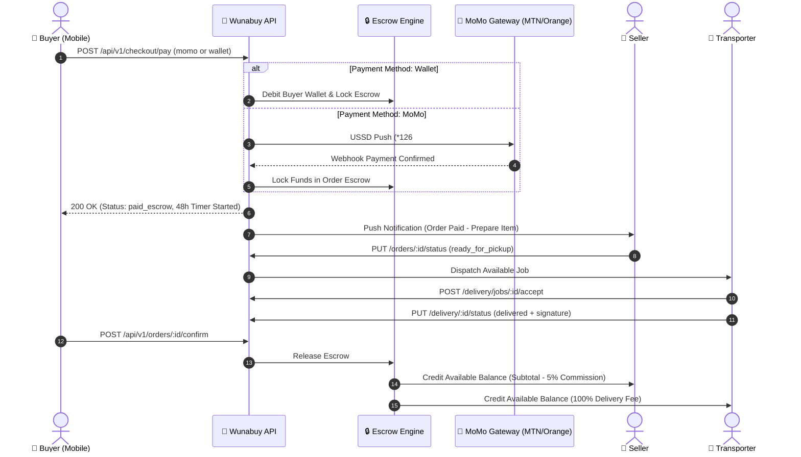

# Wunabuy Backend API Specification & Integration Contract v1.0

**Target Audience:** Backend Engineering Team (Laravel 13 / PostgreSQL / Redis / Sanctum)  
**Standard:** RESTful JSON API + WebSocket Real-Time Telemetry  
**Currency Standard:** Central African CFA Franc (`XAF` / `FCFA`)  
**Locale Default:** French / English Cameroon (`+237` E.164 phone numbers)  
**Document Status:** 🟢 **APPROVED & SYNCHRONIZED WITH MOBILE APP**

---

## 1. Architectural Overview & Global Standards

### 1.1 Base URLs
| Environment | Base URL |
|---|---|
| **Production** | `https://api.wunabuy.com/api/v1` |
| **Staging / QA** | `https://staging-api.wunabuy.com/api/v1` |
| **Local Development** | `http://10.0.2.2:8000/api/v1` (Android Emulator) / `http://localhost:8000/api/v1` (iOS Simulator) |

---

### 1.2 Global Request Headers
Every incoming HTTP request from the mobile app will include:

```http
Content-Type: application/json
Accept: application/json
Authorization: Bearer <sanctum_access_token>  (Omit only on /auth/register and /auth/verify-otp)
X-App-Version: 1.0.0
X-Idempotency-Key: <uuid-v4>                 (Required on all mutations: orders, payments, payouts)
```

---

### 1.3 Standard Response Envelope

#### ✅ Success Response (`200 OK`, `201 Created`)
```json
{
  "success": true,
  "data": { ... },
  "meta": {
    "pagination": {
      "has_more": false,
      "next_cursor": null,
      "per_page": 20,
      "total": 45
    }
  }
}
```

#### ❌ Error Response (`400`, `401`, `403`, `404`, `422`, `429`, `500`)
```json
{
  "success": false,
  "error": {
    "code": "VALIDATION_ERROR",
    "message": "The given data was invalid.",
    "details": {
      "phone": ["The phone number format is invalid (+237 6XX XXX XXX required)."]
    },
    "request_id": "req_65f8a91b_e109"
  }
}
```

---

### 1.4 Unified API Error Code Matrix
| Error Code | HTTP Status | Trigger Condition / Description |
|---|---|---|
| `VALIDATION_ERROR` | `422` | Request payload failed FormRequest validation rules. |
| `UNAUTHENTICATED` | `401` | Missing, expired, or revoked Sanctum Bearer token. |
| `FORBIDDEN` | `403` | User does not possess the required role in `user.available_roles`. |
| `NOT_FOUND` | `404` | Requested entity (product, order, wallet) does not exist. |
| `RATE_LIMIT_EXCEEDED` | `429` | Exceeded 60 requests/minute per IP/token. |
| `KYC_REQUIRED` | `403` | Store owner or driver attempted operational actions without approved KYC. |
| `INSUFFICIENT_FUNDS` | `400` | Wallet balance is lower than the requested checkout or payout amount. |
| `ESCROW_LOCKED` | `409` | Cannot cancel or modify order while funds are locked in active escrow. |
| `INVALID_ORDER_STATE` | `409` | Transitioning an order to an illegal status (e.g. `delivered` before `in_transit`). |
| `PAYMENT_GATEWAY_ERROR` | `502` | Mobile Money operator (MTN / Orange) USSD push failed or timed out. |
| `INTERNAL_SERVER_ERROR` | `500` | Unhandled backend exception. |

---

## 2. Authentication & User Profile Endpoints

### 2.1 Register / Request OTP
`POST /api/v1/auth/register`

- **Description**: Initiates phone registration or login. Generates a 6-digit OTP sent via SMS.
- **Request Body**:
```json
{
  "phone": "+237670123456",
  "full_name": "Jean Dupont",
  "role": "buyer"
}
```
- **Response `200 OK`**:
```json
{
  "success": true,
  "data": {
    "user_id": "usr_99812a",
    "phone": "+237670123456",
    "otp_sent": true,
    "expires_in_seconds": 300
  }
}
```

---

### 2.2 Verify OTP & Issue Tokens
`POST /api/v1/auth/verify-otp`

- **Description**: Verifies the SMS OTP code. Returns a Sanctum Personal Access Token, refresh token, and full User entity including `available_roles`.
- **Request Body**:
```json
{
  "phone": "+237670123456",
  "otp": "123456",
  "purpose": "login"
}
```
- **Response `200 OK`**:
```json
{
  "success": true,
  "data": {
    "access_token": "1|sanctum_token_string_here...",
    "refresh_token": "ref_token_string_here...",
    "token_type": "Bearer",
    "expires_in": 2592000,
    "user": {
      "id": "usr_99812a",
      "phone": "+237670123456",
      "email": "jean.dupont@example.com",
      "full_name": "Jean Dupont",
      "role": "buyer",
      "status": "active",
      "avatar_url": "https://api.wunabuy.com/storage/avatars/usr_99812a.jpg",
      "is_phone_verified": true,
      "default_address": {
        "id": "addr_1",
        "label": "Home",
        "latitude": 4.0510,
        "longitude": 9.7678,
        "address_text": "Rue Joss, Akwa",
        "city": "Douala",
        "is_default": true
      },
      "available_roles": ["buyer"],
      "created_at": "2026-08-20T10:00:00Z",
      "updated_at": "2026-08-28T12:00:00Z"
    }
  }
}
```

---

### 2.3 Get Current User Profile
`GET /api/v1/users/me`

- **Headers**: `Authorization: Bearer <token>`
- **Response `200 OK`**: Returns current User entity.

---

### 2.4 Update User Profile
`PUT /api/v1/users/me`

- **Headers**: `Authorization: Bearer <token>`
- **Request Body**:
```json
{
  "full_name": "Jean-Paul Dupont",
  "email": "jp.dupont@wunabuy.com",
  "avatar_url": "https://api.wunabuy.com/storage/avatars/new.jpg"
}
```
- **Response `200 OK`**: Returns updated User entity.

---

### 2.5 Update User Preferences
`PUT /api/v1/user/preferences`

- **Headers**: `Authorization: Bearer <token>`
- **Request Body**:
```json
{
  "language": "fr",
  "dark_mode": false,
  "order_updates": true,
  "chat_messages": true,
  "price_alerts": true,
  "promotions": false
}
```
- **Response `200 OK`**:
```json
{
  "success": true,
  "data": {
    "language": "fr",
    "dark_mode": false,
    "order_updates": true,
    "chat_messages": true,
    "price_alerts": true,
    "promotions": false
  }
}
```

---

### 2.6 Guarded Workspace Role Switching
`POST /api/v1/user/switch-role`

- **Headers**: `Authorization: Bearer <token>`
- **Description**: Switches the active session role. Returns `403 Forbidden` if the requested role is not approved in `user.available_roles`.
- **Request Body**:
```json
{
  "requested_role": "seller"
}
```
- **Response `200 OK`**:
```json
{
  "success": true,
  "data": {
    "active_role": "seller",
    "token": "2|sanctum_token_with_seller_abilities..."
  }
}
```
- **Response `403 Forbidden`**:
```json
{
  "success": false,
  "error": {
    "code": "FORBIDDEN",
    "message": "You are not authorized to switch to the seller role. Complete Store KYC first.",
    "details": {
      "kyc_status": "not_submitted"
    }
  }
}
```

---

## 3. Products & Catalog Management (Seller CRUD & Buyer Discovery)

### 3.1 List / Filter Products (Discovery Feed)
`GET /api/v1/products`

- **Query Parameters**:
  - `category` (optional, string: `Electronics`, `Fashion`, `Food & Groceries`, etc.)
  - `search` (optional, string: keyword search against name & description)
  - `min_price` / `max_price` (optional, number)
  - `quality_tier` (optional: `new`, `like_new`, `good`, `fair`)
  - `lat` / `lng` (optional, float GPS for proximity ordering)
  - `page` (optional, default `1`)
  - `per_page` (optional, default `20`)
- **Response `200 OK`**:
```json
{
  "success": true,
  "data": [
    {
      "id": "prod_1",
      "store_id": "store_101",
      "name": "Samsung Galaxy S24 Ultra 512GB",
      "description": "Brand new sealed in box. 1 Year warranty included.",
      "category": "Electronics",
      "price": 650000,
      "currency": "XAF",
      "quantity": 5,
      "quality_tier": "new",
      "images": [
        "https://images.unsplash.com/photo-1610945265064-0e34e5519bbf?w=800",
        "https://images.unsplash.com/photo-1592750475338-74b7b21085ab?w=800"
      ],
      "is_active": true,
      "rating_avg": 4.9,
      "total_reviews": 128,
      "distance_km": 1.8,
      "store": {
        "id": "store_101",
        "store_name": "Douala Tech Hub",
        "rating_avg": 4.9,
        "is_verified": true
      },
      "created_at": "2026-08-20T14:30:00Z",
      "updated_at": "2026-08-28T09:15:00Z"
    }
  ],
  "meta": {
    "pagination": {
      "has_more": false,
      "next_cursor": null,
      "per_page": 20,
      "total": 1
    }
  }
}
```

---

### 3.2 Get Product Details
`GET /api/v1/products/:id`

- **Response `200 OK`**: Returns full Product model with store details, stock level, and all images.

---

### 3.3 Create Product Listing (Seller Only)
`POST /api/v1/products`

- **Headers**: `Authorization: Bearer <token>` (Seller role required)
- **Request Body**:
```json
{
  "name": "Sony WH-1000XM5 Wireless Headphones",
  "description": "Industry leading noise canceling with two processors and 8 microphones.",
  "category": "Electronics",
  "price": 220000,
  "currency": "XAF",
  "quantity": 10,
  "quality_tier": "new",
  "images": [
    "https://images.unsplash.com/photo-1505740420928-5e560c06d30e?w=800",
    "https://images.unsplash.com/photo-1583394838336-acd977736f90?w=800"
  ],
  "is_active": true
}
```
- **Response `201 Created`**: Returns created Product object.

---

### 3.4 Update Product Listing (Seller Only)
`PUT /api/v1/products/:id`

- **Headers**: `Authorization: Bearer <token>` (Owner of store only)
- **Request Body**: Accepts partial updates (`price`, `quantity`, `is_active`, `description`, `images`).
- **Response `200 OK`**: Returns updated Product object.

---

### 3.5 Delete / Archive Product (Seller Only)
`DELETE /api/v1/products/:id`

- **Headers**: `Authorization: Bearer <token>`
- **Response `200 OK`**:
```json
{
  "success": true,
  "data": {
    "id": "prod_1",
    "deleted": true
  }
}
```

---

## 4. Escrow Checkout, Payment & Orders Lifecycle



---

### 4.1 Execute Dual-Method Escrow Checkout
`POST /api/v1/checkout/pay`

- **Headers**:
  - `Authorization: Bearer <token>`
  - `X-Idempotency-Key: <uuid-v4>`
- **Request Body**:
```json
{
  "items": [
    {
      "product_id": "prod_1",
      "quantity": 1
    }
  ],
  "delivery_address_id": "addr_1",
  "payment_method": "wallet",
  "phone": "+237670123456",
  "provider": "flutterwave"
}
```
- **Response `200 OK` (Wallet Escrow Lock)**:
```json
{
  "success": true,
  "data": {
    "order_id": "ord_9901",
    "order_code": "WB-2026-9842",
    "status": "paid_escrow",
    "subtotal": 650000,
    "delivery_fee": 1500,
    "commission": 32500,
    "total": 651500,
    "currency": "XAF",
    "escrow_locked": true,
    "escrow_reference": "WNB-ESC-WAL-9901-XYZ",
    "expires_at": "2026-08-30T14:30:00Z"
  }
}
```
- **Response `200 OK` (Mobile Money USSD Push)**:
```json
{
  "success": true,
  "data": {
    "order_id": "ord_9902",
    "order_code": "WB-2026-9843",
    "status": "pending_payment",
    "payment_ref": "WNB-MOMO-8821",
    "gateway_reference": "FLW-MOMO-991244",
    "instruction": "Please confirm the USSD prompt on your phone by dialing *126# (MTN) or #150*50# (Orange)."
  }
}
```

---

### 4.2 List Orders
`GET /api/v1/orders`

- **Headers**: `Authorization: Bearer <token>`
- **Query Parameters**: `status` (optional), `role` (`buyer`, `seller`, `transporter`)
- **Response `200 OK`**: Returns paginated list of Orders.

---

### 4.3 Confirm Delivery & Release Escrow
`POST /api/v1/orders/:id/confirm`

- **Headers**: `Authorization: Bearer <token>` (Buyer role required)
- **Description**: Buyer confirms receipt of goods. Escrow funds are automatically released:
  - Seller available wallet is credited `subtotal - commission (5%)`.
  - Transporter available wallet is credited `delivery_fee (100%)`.
  - Order status transitions to `completed`.
- **Response `200 OK`**:
```json
{
  "success": true,
  "data": {
    "order_id": "ord_9901",
    "status": "completed",
    "escrow_released": true,
    "completed_at": "2026-08-28T15:00:00Z"
  }
}
```

---

### 4.4 File 48H Dispute & Freeze Escrow
`POST /api/v1/orders/:id/dispute`

- **Headers**: `Authorization: Bearer <token>`
- **Description**: Freezes escrow payouts instantly. Alerts the Wunabuy Staff Resolution Portal.
- **Request Body**:
```json
{
  "reason": "damaged",
  "description": "Screen arrived cracked and box was unsealed.",
  "evidence_photos": [
    "https://api.wunabuy.com/storage/disputes/ord_9901_1.jpg",
    "https://api.wunabuy.com/storage/disputes/ord_9901_2.jpg"
  ]
}
```
- **Response `200 OK`**:
```json
{
  "success": true,
  "data": {
    "dispute_id": "dsp_7701",
    "order_id": "ord_9901",
    "status": "disputed",
    "escrow_status": "frozen",
    "opened_at": "2026-08-28T15:10:00Z"
  }
}
```

---

## 5. Wallet Ledger & Mobile Money Payouts

### 5.1 Get Wallet Summary
`GET /api/v1/wallet`

- **Headers**: `Authorization: Bearer <token>`
- **Response `200 OK`**:
```json
{
  "success": true,
  "data": {
    "balance_available": 450000,
    "balance_escrow_locked": 185000,
    "balance_total": 635000,
    "total_deposited": 500000,
    "total_payout": 50000,
    "currency": "XAF"
  }
}
```

---

### 5.2 Get Wallet Transaction History
`GET /api/v1/wallet/transactions`

- **Headers**: `Authorization: Bearer <token>`
- **Response `200 OK`**:
```json
{
  "success": true,
  "data": [
    {
      "id": "tx_101",
      "type": "ESCROW_CREDIT",
      "amount": 185000,
      "currency": "XAF",
      "status": "COMPLETED",
      "description": "Escrow hold for Order WB-2026-9842",
      "reference": "WNB-ESC-WAL-9901",
      "created_at": "2026-08-28T14:30:00Z"
    },
    {
      "id": "tx_102",
      "type": "PAYOUT",
      "amount": 25000,
      "currency": "XAF",
      "status": "COMPLETED",
      "description": "Mobile Money Payout to +237670123456",
      "reference": "WNB-PO-9912",
      "created_at": "2026-08-27T10:00:00Z"
    }
  ]
}
```

---

### 5.3 Request Instant Mobile Money Payout
`POST /api/v1/wallet/withdraw`

- **Headers**:
  - `Authorization: Bearer <token>`
  - `X-Idempotency-Key: <uuid-v4>`
- **Request Body**:
```json
{
  "amount": 25000,
  "destination_details": {
    "type": "momo",
    "phone": "+237670123456",
    "bank_code": null,
    "account_number": "+237670123456"
  }
}
```
- **Response `200 OK`**:
```json
{
  "success": true,
  "data": {
    "payout_id": "po_8891",
    "amount": 25000,
    "fee": 0,
    "net_amount": 25000,
    "currency": "XAF",
    "destination": "+237670123456",
    "status": "pending",
    "estimated_arrival": "Instant (under 5 minutes)"
  }
}
```

---

## 6. KYC Document Verification (Seller & Transporter)

### 6.1 Submit Store Owner KYC (4 Stages)
`POST /api/v1/seller/kyc/submit`

- **Headers**: `Authorization: Bearer <token>`
- **Request Body**:
```json
{
  "store_name": "Douala Tech Hub",
  "description": "Official retail distributor of smartphones and laptops.",
  "category": "Electronics",
  "latitude": 4.0510,
  "longitude": 9.7678,
  "address_text": "Rue Joss, Akwa, Douala",
  "id_card_front": "https://api.wunabuy.com/storage/kyc/cni_front_usr101.jpg",
  "id_card_back": "https://api.wunabuy.com/storage/kyc/cni_back_usr101.jpg",
  "storefront_photo": "https://api.wunabuy.com/storage/kyc/storefront_usr101.jpg",
  "business_reg_or_affidavit": "https://api.wunabuy.com/storage/kyc/rccm_usr101.pdf"
}
```
- **Response `200 OK`**:
```json
{
  "success": true,
  "data": {
    "submission_id": "kyc_sub_881",
    "status": "pending",
    "submitted_at": "2026-08-28T15:00:00Z"
  }
}
```

---

### 6.2 Submit Transporter Driver KYC (4 Stages)
`POST /api/v1/transporter/kyc/submit`

- **Headers**: `Authorization: Bearer <token>`
- **Request Body**:
```json
{
  "driver_name": "Samuel Eto'o",
  "vehicle_type": "Motorcycle",
  "vehicle_plate_number": "LT 482 AB",
  "id_card_front": "https://api.wunabuy.com/storage/kyc/cni_driver_front.jpg",
  "id_card_back": "https://api.wunabuy.com/storage/kyc/cni_driver_back.jpg",
  "driver_license": "https://api.wunabuy.com/storage/kyc/license_driver.jpg",
  "vehicle_registration": "https://api.wunabuy.com/storage/kyc/carte_grise_driver.jpg",
  "insurance_certificate": "https://api.wunabuy.com/storage/kyc/assurance_driver.jpg"
}
```
- **Response `200 OK`**:
```json
{
  "success": true,
  "data": {
    "submission_id": "t_kyc_441",
    "status": "pending",
    "submitted_at": "2026-08-28T15:00:00Z"
  }
}
```

---

## 7. Delivery Dispatch & Driver Navigation

### 7.1 List Available Delivery Jobs
`GET /api/v1/delivery/jobs`

- **Headers**: `Authorization: Bearer <token>` (Transporter role required)
- **Response `200 OK`**:
```json
{
  "success": true,
  "data": [
    {
      "id": "job_1",
      "order_id": "ord_9901",
      "order_code": "WB-2026-9842",
      "store": {
        "id": "store_101",
        "store_name": "Douala Tech Hub (Akwa)",
        "rating_avg": 4.9,
        "is_verified": true
      },
      "pickup_address": {
        "id": "p_1",
        "label": "Store Pickup",
        "latitude": 4.0510,
        "longitude": 9.7678,
        "address_text": "Rue Joss, Akwa",
        "city": "Douala",
        "is_default": false
      },
      "delivery_address": {
        "id": "d_1",
        "label": "Buyer Home",
        "latitude": 4.0611,
        "longitude": 9.7863,
        "address_text": "Boulevard de la Liberté, Bonanjo",
        "city": "Douala",
        "is_default": true
      },
      "items_summary": "1x Samsung Galaxy S24 Ultra 512GB",
      "delivery_fee": 1500,
      "currency": "XAF",
      "distance_km": 2.4,
      "status": "pending",
      "created_at": "2026-08-28T14:35:00Z"
    }
  ]
}
```

---

### 7.2 Submit Proof of Delivery
`POST /api/v1/delivery/:id/proof`

- **Headers**: `Authorization: Bearer <token>`
- **Request Body**:
```json
{
  "delivery_id": "job_1",
  "signature_data": "data:image/png;base64,iVBORw0KGgoAAA...",
  "photo_url": "https://api.wunabuy.com/storage/proofs/job_1_photo.jpg",
  "latitude": 4.0611,
  "longitude": 9.7863
}
```
- **Response `200 OK`**:
```json
{
  "success": true,
  "data": {
    "delivery_id": "job_1",
    "status": "delivered",
    "delivery_fee_credited": 1500,
    "timestamp": "2026-08-28T15:15:00Z"
  }
}
```

---

## 8. Promotions & Dynamic Banner Notifications

### 8.1 Fetch Cart Promotion Banner
`GET /api/v1/promotions/cart-banner`

- **Description**: Returns promotional banner metadata. Displays dynamically in `BuyerCartScreen` and automatically dismisses after `auto_dismiss_seconds`.
- **Response `200 OK`**:
```json
{
  "success": true,
  "data": {
    "show_banner": true,
    "headline": "🎉 Free Delivery on your first order above 25 000 FCFA!",
    "promo_id": "promo_free_delivery_august",
    "discount_code": "WUNAFREE",
    "discount_amount": 1500,
    "auto_dismiss_seconds": 6
  }
}
```

---

## 9. Staff Resolution Portal (Staff Role)

### 9.1 Approve / Reject KYC Submission
`POST /api/v1/staff/kyc/:id/review`

- **Headers**: `Authorization: Bearer <token>` (Staff role required)
- **Description**: Approving KYC automatically appends the approved role (`seller` or `transporter`) to `users.available_roles`, unlocking the role switcher button on the mobile app.
- **Request Body**:
```json
{
  "decision": "approved",
  "reviewer_notes": "All identity documents and store location verified."
}
```
- **Response `200 OK`**:
```json
{
  "success": true,
  "data": {
    "submission_id": "kyc_sub_881",
    "status": "approved",
    "user_id": "usr_101",
    "unlocked_role": "seller"
  }
}
```

---

## 10. Database Schema & Migration Checklist

```sql
-- 1. Users Table
CREATE TABLE users (
    id UUID PRIMARY KEY DEFAULT gen_random_uuid(),
    phone VARCHAR(20) UNIQUE NOT NULL,
    email VARCHAR(255) UNIQUE NULL,
    full_name VARCHAR(255) NOT NULL,
    role VARCHAR(50) NOT NULL DEFAULT 'buyer',
    status VARCHAR(50) NOT NULL DEFAULT 'active',
    avatar_url TEXT NULL,
    is_phone_verified BOOLEAN DEFAULT FALSE,
    available_roles TEXT[] NOT NULL DEFAULT '{"buyer"}',
    created_at TIMESTAMP WITH TIME ZONE DEFAULT NOW(),
    updated_at TIMESTAMP WITH TIME ZONE DEFAULT NOW()
);

-- 2. Stores Table
CREATE TABLE stores (
    id UUID PRIMARY KEY DEFAULT gen_random_uuid(),
    owner_id UUID NOT NULL REFERENCES users(id) ON DELETE CASCADE,
    store_name VARCHAR(255) NOT NULL,
    description TEXT,
    category VARCHAR(100) NOT NULL,
    latitude NUMERIC(10, 7) NOT NULL,
    longitude NUMERIC(10, 7) NOT NULL,
    address_text TEXT NOT NULL,
    rating_avg NUMERIC(3, 2) DEFAULT 5.0,
    is_verified BOOLEAN DEFAULT FALSE,
    kyc_status VARCHAR(50) DEFAULT 'not_submitted',
    created_at TIMESTAMP WITH TIME ZONE DEFAULT NOW()
);

-- 3. Products Table
CREATE TABLE products (
    id UUID PRIMARY KEY DEFAULT gen_random_uuid(),
    store_id UUID NOT NULL REFERENCES stores(id) ON DELETE CASCADE,
    name VARCHAR(255) NOT NULL,
    description TEXT NOT NULL,
    category VARCHAR(100) NOT NULL,
    price NUMERIC(12, 2) NOT NULL,
    currency VARCHAR(10) DEFAULT 'XAF',
    quantity INT NOT NULL DEFAULT 1,
    quality_tier VARCHAR(50) NOT NULL DEFAULT 'new',
    images TEXT[] NOT NULL DEFAULT '{}',
    is_active BOOLEAN DEFAULT TRUE,
    rating_avg NUMERIC(3, 2) NULL,
    total_reviews INT DEFAULT 0,
    created_at TIMESTAMP WITH TIME ZONE DEFAULT NOW(),
    updated_at TIMESTAMP WITH TIME ZONE DEFAULT NOW()
);

-- 4. Orders & Escrow Table
CREATE TABLE orders (
    id UUID PRIMARY KEY DEFAULT gen_random_uuid(),
    order_code VARCHAR(50) UNIQUE NOT NULL,
    customer_id UUID NOT NULL REFERENCES users(id),
    store_id UUID NOT NULL REFERENCES stores(id),
    transporter_id UUID NULL REFERENCES users(id),
    status VARCHAR(50) NOT NULL DEFAULT 'pending_payment',
    subtotal NUMERIC(12, 2) NOT NULL,
    delivery_fee NUMERIC(12, 2) NOT NULL DEFAULT 0,
    commission NUMERIC(12, 2) NOT NULL DEFAULT 0,
    total NUMERIC(12, 2) NOT NULL,
    currency VARCHAR(10) DEFAULT 'XAF',
    payment_method VARCHAR(50) NOT NULL,
    escrow_reference VARCHAR(100) NULL,
    expires_at TIMESTAMP WITH TIME ZONE NULL,
    delivered_at TIMESTAMP WITH TIME ZONE NULL,
    completed_at TIMESTAMP WITH TIME ZONE NULL,
    disputed_at TIMESTAMP WITH TIME ZONE NULL,
    created_at TIMESTAMP WITH TIME ZONE DEFAULT NOW()
);

-- 5. Wallets Table
CREATE TABLE wallets (
    id UUID PRIMARY KEY DEFAULT gen_random_uuid(),
    user_id UUID UNIQUE NOT NULL REFERENCES users(id) ON DELETE CASCADE,
    balance_available NUMERIC(12, 2) NOT NULL DEFAULT 0,
    balance_escrow_locked NUMERIC(12, 2) NOT NULL DEFAULT 0,
    currency VARCHAR(10) DEFAULT 'XAF',
    created_at TIMESTAMP WITH TIME ZONE DEFAULT NOW(),
    updated_at TIMESTAMP WITH TIME ZONE DEFAULT NOW()
);
```
