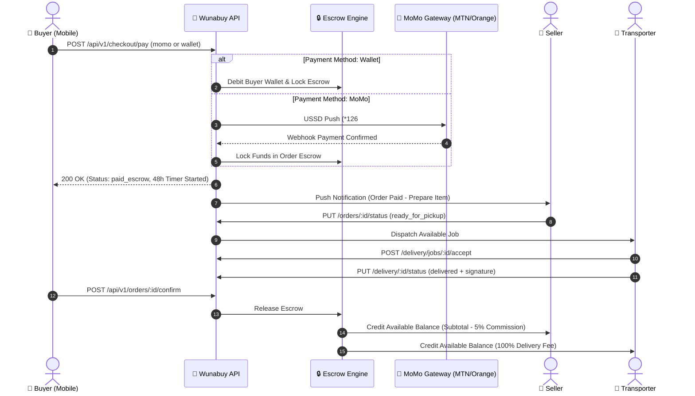

# Wunabuy Backend API Specification & Integration Contract v1.0

**Document Version:** 4.1 (Google Play Store 2026 Compliance Endpoints, Real-Time Inventory Harmonization, Live Financial Transactions Engine)  
**Date:** September 16, 2026  
**Target Audience:** Backend Engineering Team (Laravel 13 / PostgreSQL / Redis / Sanctum)  
**Standard:** RESTful JSON API + WebSocket Real-Time Telemetry  
**Currency Standard:** Central African CFA Franc (`XAF` / `FCFA`)  
**Locale Default:** French / English Cameroon (`+237` E.164 phone numbers)  
**Document Status:** 🟢 **APPROVED & SYNCHRONIZED WITH MOBILE APP & STAFF PORTAL v4.1**

---

## 1. Architectural Overview & Global Standards

### 1.1 Base URLs
| Environment | Base URL |
|---|---|
| **Production** | `https://api.wunabuy.com/api/v1` |
| **Staging / QA** | `https://staging-api.wunabuy.com/api/v1` |
| **Local Development** | `http://10.0.2.2:8000/api/v1` (Android Emulator) / `http://localhost:8000/api/v1` (iOS Simulator) |

---

### 1.2 Global Request Headers
Every incoming HTTP request from the mobile app will include:

```http
Content-Type: application/json
Accept: application/json
Authorization: Bearer <sanctum_access_token>  (Omit only on /auth/register and /auth/verify-otp)
X-App-Version: 1.0.0
X-Idempotency-Key: <uuid-v4>                 (Required on all mutations: orders, payments, payouts)
```

---

### 1.3 Standard Response Envelope

#### ✅ Success Response (`200 OK`, `201 Created`)
```json
{
  "success": true,
  "data": { ... },
  "meta": {
    "pagination": {
      "has_more": false,
      "next_cursor": null,
      "per_page": 20,
      "total": 45
    }
  }
}
```

#### ❌ Error Response (`400`, `401`, `403`, `404`, `422`, `429`, `500`)
```json
{
  "success": false,
  "error": {
    "code": "VALIDATION_ERROR",
    "message": "The given data was invalid.",
    "details": {
      "phone": ["The phone number format is invalid (+237 6XX XXX XXX required)."]
    },
    "request_id": "req_65f8a91b_e109"
  }
}
```

---

### 1.4 Unified API Error Code Matrix
| Error Code | HTTP Status | Trigger Condition / Description |
|---|---|---|
| `VALIDATION_ERROR` | `422` | Request payload failed FormRequest validation rules. |
| `UNAUTHENTICATED` | `401` | Missing, expired, or revoked Sanctum Bearer token. |
| `FORBIDDEN` | `403` | User does not possess the required role in `user.available_roles`. |
| `NOT_FOUND` | `404` | Requested entity (product, order, wallet) does not exist. |
| `RATE_LIMIT_EXCEEDED` | `429` | Exceeded 60 requests/minute per IP/token. |
| `KYC_REQUIRED` | `403` | Store owner or driver attempted operational actions without approved KYC. |
| `INSUFFICIENT_FUNDS` | `400` | Wallet balance is lower than the requested checkout or payout amount. |
| `ESCROW_LOCKED` | `409` | Cannot cancel or modify order while funds are locked in active escrow. |
| `INVALID_ORDER_STATE` | `409` | Transitioning an order to an illegal status (e.g. `delivered` before `in_transit`). |
| `PAYMENT_GATEWAY_ERROR` | `502` | Mobile Money operator (MTN / Orange) USSD push failed or timed out. |
| `INTERNAL_SERVER_ERROR` | `500` | Unhandled backend exception. |

---

## 2. Authentication & User Profile Endpoints

### 2.1 Register Account with PIN
`POST /api/v1/auth/register`

- **Description**: Registers a new user with phone number, full name, role, optional delivery address, and a secure 6-digit PIN. Automatically creates the user's PostgreSQL record, initializes their wallet (with welcome credit), records their default address, hashes the PIN via bcrypt, and returns an active Sanctum Bearer token with full eager-loaded profile and permissions.
- **Request Body**:
```json
{
  "phone": "+237670123456",
  "full_name": "Jean Dupont",
  "role": "buyer",
  "pin": "123456",
  "address_text": "Boulevard de la Liberté, Bonanjo",
  "city": "Douala"
}
```
- **Response `200 OK`**:
```json
{
  "success": true,
  "data": {
    "access_token": "4|sKSY9rrYSLznnAiVt5dh9IYnOLWLjtjoNDRXXCei49f26745",
    "token_type": "Bearer",
    "user": {
      "id": "01a086d2-5032-73f4-8e9d-20b1ffbee61a",
      "phone": "+237670123456",
      "email": null,
      "full_name": "Jean Dupont",
      "role": "buyer",
      "status": "active",
      "avatar_url": null,
      "is_phone_verified": true,
      "available_roles": ["buyer"],
      "permissions": [
        "browse_catalog",
        "view_product",
        "create_order",
        "cancel_order",
        "manage_cart",
        "manage_wallet",
        "fund_wallet",
        "withdraw_wallet",
        "file_dispute",
        "submit_review",
        "manage_addresses",
        "view_orders",
        "track_delivery"
      ],
      "wallet": {
        "id": "01a086d2-5044-729c-9b7d-d66411032e5e",
        "balance_available": 50000,
        "balance_escrow_locked": 0,
        "currency": "XAF"
      },
      "default_address": {
        "id": "01a086d2-505b-72bf-924e-2329e9689910",
        "label": "Home",
        "address_text": "Boulevard de la Liberté, Bonanjo",
        "city": "Douala",
        "latitude": 4.0510564,
        "longitude": 9.7678687,
        "is_default": true
      },
      "store": null,
      "transporter": null,
      "created_at": "2026-09-09T15:38:45+00:00",
      "updated_at": "2026-09-09T15:38:45+00:00"
    }
  },
  "meta": {
    "timestamp": "2026-09-09T15:38:45+00:00",
    "request_id": "req_KDThzEZf6nRt"
  }
}
```

---

### 2.2 Login via 6-Digit PIN
`POST /api/v1/auth/login-pin`

- **Description**: Authenticates returning users via phone number and 6-digit security PIN without requiring external SMS delivery. Verifies bcrypt PIN hash, generates a Sanctum Bearer token, and eager-loads the user's live profile, wallet balances, and role permissions.
- **Request Body**:
```json
{
  "phone": "+237670123456",
  "pin": "123456"
}
```
- **Response `200 OK`**:
```json
{
  "success": true,
  "data": {
    "access_token": "5|i3Nf3nvev1HqNrYOwmci2lWX4DeRpWI46B1R0IuL3fa2d5ae",
    "token_type": "Bearer",
    "user": {
      "id": "9b1deb4d-3b7d-4bad-9bdd-2b0d7b3dcb6d",
      "phone": "+237670123456",
      "email": "jean.dupont@wunabuy.com",
      "full_name": "Jean Dupont",
      "role": "buyer",
      "status": "active",
      "avatar_url": "https://images.unsplash.com/photo-1534528741775-53994a69daeb?auto=format&fit=crop&w=400&q=80",
      "is_phone_verified": true,
      "available_roles": ["buyer"],
      "permissions": [
        "browse_catalog",
        "view_product",
        "create_order",
        "cancel_order",
        "manage_cart",
        "manage_wallet",
        "fund_wallet",
        "withdraw_wallet",
        "file_dispute",
        "submit_review",
        "manage_addresses",
        "view_orders",
        "track_delivery"
      ],
      "wallet": {
        "id": "c1cc5a78-bb8c-4f61-b598-e83cedb0a540",
        "balance_available": 47500,
        "balance_escrow_locked": 236000,
        "currency": "XAF"
      },
      "default_address": null,
      "store": null,
      "transporter": null,
      "created_at": "2026-09-08T12:33:33+00:00",
      "updated_at": "2026-09-09T15:33:06+00:00"
    }
  },
  "meta": {
    "timestamp": "2026-09-09T15:39:12+00:00",
    "request_id": "req_PLfAARoDgoUH"
  }
}
```

---

### 2.3 Verify SMS OTP (Future 2FA / Gateway Integration)
`POST /api/v1/auth/verify-otp`

- **Description**: Verifies an SMS OTP code (or demo code `123456`). When SMS gateway is active, can be used as a phone ownership verification checkpoint or second-factor authentication.
- **Request Body**:
```json
{
  "phone": "+237670123456",
  "otp": "123456",
  "purpose": "login"
}
```
- **Response `200 OK`**: Matches standard auth envelope with Bearer token, permissions, and eager-loaded wallet.

---

### 2.4 Refresh Sanctum Access Token
`POST /api/v1/auth/refresh`

- **Headers**: `Authorization: Bearer <sanctum_token>`
- **Description**: Refreshes an active or recently expired Sanctum Bearer token. Revokes the existing token and returns a fresh Bearer token along with the eager-loaded User entity, role permissions, and wallet balances.
- **Request Body**: Optional `{ "user_id": "<uuid>" }` (used in fallback modes)
- **Response `200 OK`**:
```json
{
  "success": true,
  "data": {
    "access_token": "6|d7F4k9qLw0Zp9yRt8Nm4bV1cX7aK3jH6pE5gT2sA1e9c8b7",
    "token_type": "Bearer",
    "user": {
      "id": "01a0811d-27f9-7298-9b64-7cff01362fbe",
      "phone": "+237682656287",
      "email": "brandon@wunabuy.com",
      "full_name": "Forku Brandon",
      "role": "seller",
      "status": "active",
      "available_roles": ["buyer", "seller", "transporter"]
    }
  }
}
```
- **Response `401 UNAUTHENTICATED`**: If the caller has no valid token and cannot be resolved.

---

### 2.5 Mint Local Developer Session Token
`POST /api/v1/auth/dev-session`

- **Headers**: `Content-Type: application/json`
- **Description**: Available exclusively in local/staging environments (`APP_ENV=local`). Allows the mobile application (`apiClient.ts`) to auto-recover developer testing sessions without prompting manual re-login when local tokens expire. Accepts developer `phone` or `user_id`, authenticates the developer account, and mints a fresh valid Sanctum access token.
- **Request Body**:
```json
{
  "phone": "+237682656287",
  "user_id": "01a0811d-27f9-7298-9b64-7cff01362fbe"
}
```
- **Response `200 OK`**:
```json
{
  "success": true,
  "data": {
    "access_token": "7|m1R9pQ8aB2cD3eF4gH5jK6lN7oP8qR9sT0uV1wX2yZ3a4b5",
    "token_type": "Bearer",
    "user": {
      "id": "01a0811d-27f9-7298-9b64-7cff01362fbe",
      "phone": "+237682656287",
      "email": "brandon@wunabuy.com",
      "full_name": "Forku Brandon",
      "role": "seller",
      "status": "active",
      "available_roles": ["buyer", "seller", "transporter"]
    }
  }
}
```
- **Response `404 NOT FOUND`**: If the requested developer user does not exist.

---

### 2.6 Get Current User Profile
`GET /api/v1/users/me`

- **Headers**: `Authorization: Bearer <token>`
- **Description**: Returns current authenticated User entity with eager-loaded `wallet`, `default_address`, `store`, and `transporter` relations. Zero mock data is returned; if relations have not yet been registered, they are returned as `null`.
- **Response `200 OK`**: Returns current User entity.

---

### 2.7 Update User Profile
`PUT /api/v1/users/me` or `PATCH /api/v1/user/profile`

- **Headers**: `Authorization: Bearer <token>`
- **Description**: Updates user profile attributes with strict uniqueness validation on `phone` and `email`. If another account is already registered with the specified phone or email, the backend rejects the request with HTTP 422.
- **Request Body**:
```json
{
  "full_name": "Forku Brandon",
  "email": "brandon@wunabuy.com",
  "phone": "+237682656287",
  "avatar_url": "https://api.wunabuy.com/storage/avatars/new.jpg"
}
```
- **Response `200 OK`**: Returns updated User entity.
- **Response `422 UNPROCESSABLE ENTITY` (Uniqueness Violation)**:
```json
{
  "success": false,
  "error": {
    "code": "VALIDATION_ERROR",
    "message": "The given data was invalid.",
    "details": {
      "phone": ["This phone number is already registered to another account."],
      "email": ["This email address is already associated with an existing account."]
    }
  }
}
```

---

### 2.4A Upload Profile Avatar Photo
`POST /api/v1/user/avatar`

- **Headers**: `Authorization: Bearer <token>`, `Content-Type: multipart/form-data`
- **Request Form Data**: `avatar: File (image/jpeg, image/png, image/webp; max 5MB)`
- **Response `200 OK`**:
```json
{
  "success": true,
  "data": {
    "avatar_url": "https://api.wunabuy.com/storage/avatars/usr_99812a_17879300.jpg",
    "user_id": "usr_99812a",
    "updated_at": "2026-08-28T16:00:00Z"
  }
}
```
- **Error Responses**:
  - `422 UNPROCESSABLE ENTITY`: File exceeds 5MB or invalid MIME type.
  - `401 UNAUTHENTICATED`: Missing or expired Sanctum Bearer token.

---

### 2.5 Update User Preferences
`PUT /api/v1/user/preferences`

- **Headers**: `Authorization: Bearer <token>`
- **Request Body**:
```json
{
  "language": "fr",
  "dark_mode": false,
  "order_updates": true,
  "chat_messages": true,
  "price_alerts": true,
  "promotions": false
}
```
- **Response `200 OK`**:
```json
{
  "success": true,
  "data": {
    "language": "fr",
    "dark_mode": false,
    "order_updates": true,
    "chat_messages": true,
    "price_alerts": true,
    "promotions": false
  }
}
```

---

### 2.6 Guarded Workspace Role Switching
`POST /api/v1/user/switch-role`

- **Headers**: `Authorization: Bearer <token>`
- **Description**: Switches the active session role. Returns `403 Forbidden` if the requested role is not approved in `user.available_roles`.
- **Request Body**:
```json
{
  "requested_role": "seller"
}
```
- **Response `200 OK`**:
```json
{
  "success": true,
  "data": {
    "active_role": "seller",
    "token": "2|sanctum_token_with_seller_abilities..."
  }
}
```
- **Response `403 Forbidden`**:
```json
{
  "success": false,
  "error": {
    "code": "FORBIDDEN",
    "message": "You are not authorized to switch to the seller role. Complete Store KYC first.",
    "details": {
      "kyc_status": "not_submitted"
    }
  }
}
```

---

## 3. Products & Catalog Management (Seller CRUD & Buyer Discovery)

### 3.1 List / Filter Products (Discovery Feed)
`GET /api/v1/products`

- **Query Parameters**:
  - `category` (optional, string: `Electronics`, `Fashion`, `Food & Groceries`, etc.)
  - `search` (optional, string: keyword search against name & description)
  - `min_price` / `max_price` (optional, number)
  - `quality_tier` (optional: `new`, `like_new`, `good`, `fair`)
  - `lat` / `lng` (optional, float GPS for proximity ordering)
  - `page` (optional, default `1`)
  - `per_page` (optional, default `20`)
- **Response `200 OK`**:
```json
{
  "success": true,
  "data": [
    {
      "id": "prod_1",
      "store_id": "store_101",
      "name": "Samsung Galaxy S24 Ultra 512GB",
      "description": "Brand new sealed in box. 1 Year warranty included.",
      "category": "Electronics",
      "price": 650000,
      "currency": "XAF",
      "quantity": 5,
      "quality_tier": "new",
      "images": [
        "https://images.unsplash.com/photo-1610945265064-0e34e5519bbf?w=800",
        "https://images.unsplash.com/photo-1592750475338-74b7b21085ab?w=800"
      ],
      "is_active": true,
      "rating_avg": 4.9,
      "total_reviews": 128,
      "distance_km": 1.8,
      "store": {
        "id": "store_101",
        "store_name": "Douala Tech Hub",
        "rating_avg": 4.9,
        "is_verified": true
      },
      "created_at": "2026-08-20T14:30:00Z",
      "updated_at": "2026-08-28T09:15:00Z"
    }
  ],
  "meta": {
    "pagination": {
      "has_more": false,
      "next_cursor": null,
      "per_page": 20,
      "total": 1
    }
  }
}
```

---

### 3.2 Get Product Details
`GET /api/v1/products/:id`

- **Response `200 OK`**: Returns full Product model with store details, stock level, and all images.

---

### 3.3 Create Product Listing (Seller Only)
`POST /api/v1/products`

- **Headers**: `Authorization: Bearer <token>` (Seller role required)
- **Request Body**:
```json
{
  "name": "Sony WH-1000XM5 Wireless Headphones",
  "description": "Industry leading noise canceling with two processors and 8 microphones.",
  "category": "Electronics",
  "price": 220000,
  "currency": "XAF",
  "quantity": 10,
  "quality_tier": "new",
  "images": [
    "https://images.unsplash.com/photo-1505740420928-5e560c06d30e?w=800",
    "https://images.unsplash.com/photo-1583394838336-acd977736f90?w=800"
  ],
  "is_active": true
}
```
- **Response `201 Created`**: Returns created Product object.

---

### 3.4 Update Product Listing (Seller Only)
`PUT /api/v1/products/:id`

- **Headers**: `Authorization: Bearer <token>` (Owner of store only)
- **Request Body**: Accepts partial updates (`price`, `quantity`, `is_active`, `description`, `images`).
- **Response `200 OK`**: Returns updated Product object.

---

### 3.5 Delete / Archive Product (Seller Only)
`DELETE /api/v1/products/:id`

- **Headers**: `Authorization: Bearer <token>`
- **Response `200 OK`**:
```json
{
  "success": true,
  "data": {
    "id": "prod_1",
    "deleted": true
  }
}
```

---

## 4. Escrow Checkout, Payment & Orders Lifecycle



---

### 4.1 Execute Dual-Method Escrow Checkout
`POST /api/v1/checkout/pay`

- **Headers**:
  - `Authorization: Bearer <token>`
  - `X-Idempotency-Key: <uuid-v4>`
- **Request Body**:
```json
{
  "items": [
    {
      "product_id": "prod_1",
      "quantity": 1
    }
  ],
  "delivery_address_id": "addr_1",
  "payment_method": "wallet",
  "phone": "+237670123456",
  "provider": "flutterwave"
}
```
- **Response `200 OK` (Wallet Escrow Lock)**:
```json
{
  "success": true,
  "data": {
    "order_id": "ord_9901",
    "order_code": "WB-2026-9842",
    "status": "paid_escrow",
    "subtotal": 650000,
    "delivery_fee": 1500,
    "commission": 32500,
    "total": 651500,
    "currency": "XAF",
    "escrow_locked": true,
    "escrow_reference": "WNB-ESC-WAL-9901-XYZ",
    "expires_at": "2026-08-30T14:30:00Z"
  }
}
```
- **Response `200 OK` (Mobile Money USSD Push)**:
```json
{
  "success": true,
  "data": {
    "order_id": "ord_9902",
    "order_code": "WB-2026-9843",
    "status": "pending_payment",
    "payment_ref": "WNB-MOMO-8821",
    "gateway_reference": "FLW-MOMO-991244",
    "instruction": "Please confirm the USSD prompt on your phone by dialing *126# (MTN) or #150*50# (Orange)."
  }
}
```

---

### 4.2 List Orders
`GET /api/v1/orders`

- **Headers**: `Authorization: Bearer <token>`
- **Query Parameters**: `status` (optional), `role` (`buyer`, `seller`, `transporter`)
- **Response `200 OK`**: Returns paginated list of Orders.

---

### 4.3 Confirm Delivery & Release Escrow
`POST /api/v1/orders/:id/confirm`

- **Headers**: `Authorization: Bearer <token>` (Buyer role required)
- **Description**: Buyer confirms receipt of goods. Escrow funds are automatically released:
  - Seller available wallet is credited `subtotal - commission (5%)`.
  - Transporter available wallet is credited `delivery_fee (100%)`.
  - Order status transitions to `completed`.
- **Response `200 OK`**:
```json
{
  "success": true,
  "data": {
    "order_id": "ord_9901",
    "status": "completed",
    "escrow_released": true,
    "completed_at": "2026-08-28T15:00:00Z"
  }
}
```

---

### 4.4 File 48H Dispute & Freeze Escrow
`POST /api/v1/orders/:id/dispute`

- **Headers**: `Authorization: Bearer <token>`
- **Description**: Freezes escrow payouts instantly. Alerts the Wunabuy Staff Resolution Portal.
- **Request Body**:
```json
{
  "reason": "damaged",
  "description": "Screen arrived cracked and box was unsealed.",
  "evidence_photos": [
    "https://api.wunabuy.com/storage/disputes/ord_9901_1.jpg",
    "https://api.wunabuy.com/storage/disputes/ord_9901_2.jpg"
  ]
}
```
- **Response `200 OK`**:
```json
{
  "success": true,
  "data": {
    "dispute_id": "dsp_7701",
    "order_id": "ord_9901",
    "status": "disputed",
    "escrow_status": "frozen",
    "opened_at": "2026-08-28T15:10:00Z"
  }
}
```

---

### 4.5 Accept Order (Seller — 2-Hour Timeout Rule)
`POST /api/v1/seller/orders/:id/accept`

- **Headers**: `Authorization: Bearer <token>`
- **Description**: Stores must accept orders within 2 hours or the system auto-cancels and refunds the buyer (BR-01).
- **Response `200 OK`**: Transitions order from `pending_payment`/`paid_escrow` to `preparing`.

---

### 4.6 Decline Order (Seller)
`POST /api/v1/seller/orders/:id/decline`

- **Headers**: `Authorization: Bearer <token>`
- **Request Body**:
```json
{
  "reason": "Out of Stock"
}
```
- **Response `200 OK`**: Triggers immediate full escrow refund to buyer.

---

### 4.7 Mark Ready for Pickup & Dispatch Delivery Method (Seller)
`POST /api/v1/seller/orders/:id/ready`

- **Headers**: `Authorization: Bearer <token>`
- **Request Body**:
```json
{
  "delivery_method": "wunabuy_transporter",
  "driver_phone": "+237670998877"
}
```
- **Response `200 OK`**: Broadcasts job to nearby transport providers or records in-house rider contact.

---

## 5. Wallet Ledger & Mobile Money Payouts

### 5.1 Get Wallet Summary
`GET /api/v1/wallet`

- **Headers**: `Authorization: Bearer <token>`
- **Response `200 OK`**:
```json
{
  "success": true,
  "data": {
    "balance_available": 450000,
    "balance_escrow_locked": 185000,
    "balance_total": 635000,
    "total_deposited": 500000,
    "total_payout": 50000,
    "currency": "XAF"
  }
}
```

---

### 5.2 Get Wallet Transaction History
`GET /api/v1/wallet/transactions`

- **Headers**: `Authorization: Bearer <token>`
- **Response `200 OK`**:
```json
{
  "success": true,
  "data": [
    {
      "id": "tx_101",
      "type": "ESCROW_CREDIT",
      "amount": 185000,
      "currency": "XAF",
      "status": "COMPLETED",
      "description": "Escrow hold for Order WB-2026-9842",
      "reference": "WNB-ESC-WAL-9901",
      "created_at": "2026-08-28T14:30:00Z"
    },
    {
      "id": "tx_102",
      "type": "PAYOUT",
      "amount": 25000,
      "currency": "XAF",
      "status": "COMPLETED",
      "description": "Mobile Money Payout to +237670123456",
      "reference": "WNB-PO-9912",
      "created_at": "2026-08-27T10:00:00Z"
    }
  ]
}
```

---

### 5.3 Request Instant Mobile Money Payout
`POST /api/v1/wallet/withdraw`

- **Headers**:
  - `Authorization: Bearer <token>`
  - `X-Idempotency-Key: <uuid-v4>`
- **Request Body**:
```json
{
  "amount": 25000,
  "destination_details": {
    "type": "momo",
    "phone": "+237670123456",
    "bank_code": null,
    "account_number": "+237670123456"
  }
}
```
- **Response `200 OK`**:
```json
{
  "success": true,
  "data": {
    "payout_id": "po_8891",
    "amount": 25000,
    "fee": 0,
    "net_amount": 25000,
    "currency": "XAF",
    "destination": "+237670123456",
    "status": "pending",
    "estimated_arrival": "Instant (under 5 minutes)"
  }
}
```

---

## 6. KYC Document Verification (Seller & Transporter)

### 6.1 Submit Store Owner KYC (4 Stages)
`POST /api/v1/seller/kyc/submit`

- **Headers**: `Authorization: Bearer <token>`
- **Request Body**:
```json
{
  "store_name": "Douala Tech Hub",
  "description": "Official retail distributor of smartphones and laptops.",
  "category": "Electronics",
  "latitude": 4.0510,
  "longitude": 9.7678,
  "address_text": "Rue Joss, Akwa, Douala",
  "id_card_front": "https://api.wunabuy.com/storage/kyc/cni_front_usr101.jpg",
  "id_card_back": "https://api.wunabuy.com/storage/kyc/cni_back_usr101.jpg",
  "storefront_photo": "https://api.wunabuy.com/storage/kyc/storefront_usr101.jpg",
  "business_reg_or_affidavit": "https://api.wunabuy.com/storage/kyc/rccm_usr101.pdf"
}
```
- **Response `200 OK`**:
```json
{
  "success": true,
  "data": {
    "submission_id": "kyc_sub_881",
    "status": "pending",
    "submitted_at": "2026-08-28T15:00:00Z"
  }
}
```

---

### 6.2 Submit Transporter Driver KYC (4 Stages)
`POST /api/v1/transporter/kyc/submit`

- **Headers**: `Authorization: Bearer <token>`
- **Request Body**:
```json
{
  "driver_name": "Samuel Eto'o",
  "vehicle_type": "Motorcycle",
  "vehicle_plate_number": "LT 482 AB",
  "id_card_front": "https://api.wunabuy.com/storage/kyc/cni_driver_front.jpg",
  "id_card_back": "https://api.wunabuy.com/storage/kyc/cni_driver_back.jpg",
  "driver_license": "https://api.wunabuy.com/storage/kyc/license_driver.jpg",
  "vehicle_registration": "https://api.wunabuy.com/storage/kyc/carte_grise_driver.jpg",
  "insurance_certificate": "https://api.wunabuy.com/storage/kyc/assurance_driver.jpg"
}
```
- **Response `200 OK`**:
```json
{
  "success": true,
  "data": {
    "submission_id": "t_kyc_441",
    "status": "pending",
    "submitted_at": "2026-08-28T15:00:00Z"
  }
}
```

---

## 7. Delivery Dispatch & Driver Navigation

### 7.1 List Available Delivery Jobs
`GET /api/v1/delivery/jobs`

- **Headers**: `Authorization: Bearer <token>` (Transporter role required)
- **Response `200 OK`**:
```json
{
  "success": true,
  "data": [
    {
      "id": "job_1",
      "order_id": "ord_9901",
      "order_code": "WB-2026-9842",
      "store": {
        "id": "store_101",
        "store_name": "Douala Tech Hub (Akwa)",
        "rating_avg": 4.9,
        "is_verified": true
      },
      "pickup_address": {
        "id": "p_1",
        "label": "Store Pickup",
        "latitude": 4.0510,
        "longitude": 9.7678,
        "address_text": "Rue Joss, Akwa",
        "city": "Douala",
        "is_default": false
      },
      "delivery_address": {
        "id": "d_1",
        "label": "Buyer Home",
        "latitude": 4.0611,
        "longitude": 9.7863,
        "address_text": "Boulevard de la Liberté, Bonanjo",
        "city": "Douala",
        "is_default": true
      },
      "items_summary": "1x Samsung Galaxy S24 Ultra 512GB",
      "delivery_fee": 1500,
      "currency": "XAF",
      "distance_km": 2.4,
      "status": "pending",
      "created_at": "2026-08-28T14:35:00Z"
    }
  ]
}
```

---

### 7.2 Submit Proof of Delivery
`POST /api/v1/delivery/:id/proof`

- **Headers**: `Authorization: Bearer <token>`
- **Request Body**:
```json
{
  "delivery_id": "job_1",
  "signature_data": "data:image/png;base64,iVBORw0KGgoAAA...",
  "photo_url": "https://api.wunabuy.com/storage/proofs/job_1_photo.jpg",
  "latitude": 4.0611,
  "longitude": 9.7863
}
```
- **Response `200 OK`**:
```json
{
  "success": true,
  "data": {
    "delivery_id": "job_1",
    "status": "delivered",
    "delivery_fee_credited": 1500,
    "timestamp": "2026-08-28T15:15:00Z"
  }
}
```

---

## 8. Promotions & Dynamic Banner Notifications

### 8.1 Fetch Cart Promotion Banner
`GET /api/v1/promotions/cart-banner`

- **Description**: Returns promotional banner metadata. Displays dynamically in `BuyerCartScreen` and automatically dismisses after `auto_dismiss_seconds`.
- **Response `200 OK`**:
```json
{
  "success": true,
  "data": {
    "show_banner": true,
    "headline": "🎉 Free Delivery on your first order above 25 000 FCFA!",
    "promo_id": "promo_free_delivery_august",
    "discount_code": "WUNAFREE",
    "discount_amount": 1500,
    "auto_dismiss_seconds": 6
  }
}
```

---

## 9. Staff Resolution Portal (Staff Role)

### 9.1 Approve / Reject KYC Submission
`POST /api/v1/staff/kyc/:id/review`

- **Headers**: `Authorization: Bearer <token>` (Staff role required)
- **Description**: Approving KYC automatically appends the approved role (`seller` or `transporter`) to `users.available_roles`, unlocking the role switcher button on the mobile app.
- **Request Body**:
```json
{
  "decision": "approved",
  "reviewer_notes": "All identity documents and store location verified."
}
```
- **Response `200 OK`**:
```json
{
  "success": true,
  "data": {
    "submission_id": "kyc_sub_881",
    "status": "approved",
    "user_id": "usr_101",
    "unlocked_role": "seller"
  }
}
```

---

## 10. Seller Store & Fulfillment API Endpoints

### 10.1 Get Seller Dashboard Metrics
`GET /api/v1/seller/dashboard`

- **Headers**: `Authorization: Bearer <token>`
- **Description**: Returns live revenue, balance, order counts, and active product metrics for the authenticated merchant store.
- **Response `200 OK`**:
```json
{
  "success": true,
  "data": {
    "store_id": "store_101",
    "store_name": "Douala Tech Hub",
    "available_balance": 185000,
    "escrow_locked_balance": 45000,
    "currency": "XAF",
    "today_sales": 72500,
    "pending_orders_count": 3,
    "active_products_count": 18,
    "store_rating": 4.9,
    "kyc_status": "approved"
  }
}
```

---

### 10.2 List Store Orders
`GET /api/v1/seller/orders?status=all`

- **Headers**: `Authorization: Bearer <token>`
- **Query Parameters**: `status` (`all` | `new` | `preparing` | `ready_for_pickup` | `in_transit` | `completed` | `disputed`)
- **Response `200 OK`**:
```json
{
  "success": true,
  "data": [
    {
      "id": "ord_88201",
      "order_code": "WUNA-98214",
      "customer_id": "usr_buyer_1",
      "customer_name": "Jean Dupont",
      "customer_phone": "+237670123456",
      "delivery_address": "Rue Joss, Bonanjo, Douala",
      "status": "paid_escrow",
      "created_at": "2026-08-31T10:00:00Z",
      "expires_at": "2026-08-31T12:00:00Z",
      "subtotal": 45000,
      "commission": 2250,
      "total": 45000,
      "items": [
        {
          "product_id": "prod_1",
          "name": "Sony WH-1000XM5 Wireless Headphones",
          "quantity": 1,
          "price": 45000,
          "image_url": "https://api.wunabuy.com/storage/products/sony.jpg"
        }
      ],
      "transporter_name": null,
      "transporter_phone": null
    }
  ]
}
```

---

### 10.3 Accept Store Order (Within 2-Hour Window)
`POST /api/v1/seller/orders/:id/accept`

- **Headers**: `Authorization: Bearer <token>`
- **Description**: Transitions order from `paid_escrow` to `preparing`. Cancels the 2-hour auto-cancellation timer.
- **Response `200 OK`**:
```json
{
  "success": true,
  "data": {
    "order_id": "ord_88201",
    "status": "preparing",
    "accepted_at": "2026-08-31T10:15:00Z"
  }
}
```

---

### 10.4 Decline Store Order
`POST /api/v1/seller/orders/:id/decline`

- **Headers**: `Authorization: Bearer <token>`
- **Request Body**:
```json
{
  "reason": "out_of_stock",
  "note": "Item was sold out in physical store"
}
```
- **Response `200 OK`**:
```json
{
  "success": true,
  "data": {
    "order_id": "ord_88201",
    "status": "cancelled",
    "refund_initiated": true,
    "buyer_notified": true
  }
}
```

---

### 10.5 Mark Ready for Pickup & Choose Delivery Dispatch
`POST /api/v1/seller/orders/:id/ready`

- **Headers**: `Authorization: Bearer <token>`
- **Request Body**:
```json
{
  "delivery_option": "wunabuy_transporter",
  "in_house_rider_phone": null
}
```
*(Or with in-house delivery: `{"delivery_option": "in_house_rider", "in_house_rider_phone": "+237699112233"}`)*
- **Response `200 OK`**:
```json
{
  "success": true,
  "data": {
    "order_id": "ord_88201",
    "status": "ready_for_pickup",
    "dispatch_mode": "wunabuy_transporter",
    "job_broadcast_id": "job_bcast_9921"
  }
}
```

---

### 10.6 Handover Order to Rider
`POST /api/v1/seller/orders/:id/handover`

- **Headers**: `Authorization: Bearer <token>`
- **Description**: Confirms that the store has physically handed the package to the designated transporter.
- **Response `200 OK`**:
```json
{
  "success": true,
  "data": {
    "order_id": "ord_88201",
    "status": "in_transit",
    "transporter_id": "usr_rider_44",
    "departed_at": "2026-08-31T10:45:00Z"
  }
}
```

---

### 10.7 Store Products CRUD & Stock Steppers
- `GET /api/v1/seller/products`: Returns list of all store products.
- `POST /api/v1/seller/products`: Creates a new product listing.
- `PUT /api/v1/seller/products/:id`: Updates an existing product listing.
- `PATCH /api/v1/seller/products/:id/stock`: Increments/decrements available stock (`{ "delta": 1 }` or `{ "delta": -1 }`).
- `PATCH /api/v1/seller/products/:id/toggle-active`: Toggles product active/paused state (`{ "is_active": true }`).
- `DELETE /api/v1/seller/products/:id`: Soft-deletes a product listing from the catalog feed.

---

### 10.8 Seller Mobile Money Payout Request
`POST /api/v1/seller/wallet/payout`

- **Headers**: `Authorization: Bearer <token>`, `X-Idempotency-Key: <uuid>`
- **Request Body**:
```json
{
  "amount": 50000,
  "destination_type": "momo",
  "phone": "+237670123456",
  "provider": "mtn"
}
```
- **Response `200 OK`**:
```json
{
  "success": true,
  "data": {
    "payout_id": "payout_88219",
    "amount_requested": 50000,
    "fee_deducted": 500,
    "net_payout": 49500,
    "currency": "XAF",
    "destination": "+237 670 123 456 (MTN MoMo)",
    "status": "processing",
    "estimated_arrival": "Instant (under 5 minutes)"
  }
}
```

---

## 11. Database Schema & Migration Checklist

```sql
-- 1. Users Table
CREATE TABLE users (
    id UUID PRIMARY KEY DEFAULT gen_random_uuid(),
    phone VARCHAR(20) UNIQUE NOT NULL,
    email VARCHAR(255) UNIQUE NULL,
    full_name VARCHAR(255) NOT NULL,
    role VARCHAR(50) NOT NULL DEFAULT 'buyer',
    status VARCHAR(50) NOT NULL DEFAULT 'active',
    avatar_url TEXT NULL,
    is_phone_verified BOOLEAN DEFAULT FALSE,
    available_roles TEXT[] NOT NULL DEFAULT '{"buyer"}',
    created_at TIMESTAMP WITH TIME ZONE DEFAULT NOW(),
    updated_at TIMESTAMP WITH TIME ZONE DEFAULT NOW()
);

-- 2. Stores Table
CREATE TABLE stores (
    id UUID PRIMARY KEY DEFAULT gen_random_uuid(),
    owner_id UUID NOT NULL REFERENCES users(id) ON DELETE CASCADE,
    store_name VARCHAR(255) NOT NULL,
    description TEXT,
    category VARCHAR(100) NOT NULL,
    latitude NUMERIC(10, 7) NOT NULL,
    longitude NUMERIC(10, 7) NOT NULL,
    address_text TEXT NOT NULL,
    rating_avg NUMERIC(3, 2) DEFAULT 5.0,
    is_verified BOOLEAN DEFAULT FALSE,
    kyc_status VARCHAR(50) DEFAULT 'not_submitted',
    created_at TIMESTAMP WITH TIME ZONE DEFAULT NOW()
);

-- 3. Products Table
CREATE TABLE products (
    id UUID PRIMARY KEY DEFAULT gen_random_uuid(),
    store_id UUID NOT NULL REFERENCES stores(id) ON DELETE CASCADE,
    name VARCHAR(255) NOT NULL,
    description TEXT NOT NULL,
    category VARCHAR(100) NOT NULL,
    price NUMERIC(12, 2) NOT NULL,
    currency VARCHAR(10) DEFAULT 'XAF',
    quantity INT NOT NULL DEFAULT 1,
    quality_tier VARCHAR(50) NOT NULL DEFAULT 'new',
    images TEXT[] NOT NULL DEFAULT '{}',
    is_active BOOLEAN DEFAULT TRUE,
    rating_avg NUMERIC(3, 2) NULL,
    total_reviews INT DEFAULT 0,
    created_at TIMESTAMP WITH TIME ZONE DEFAULT NOW(),
    updated_at TIMESTAMP WITH TIME ZONE DEFAULT NOW()
);

-- 4. Orders & Escrow Table
CREATE TABLE orders (
    id UUID PRIMARY KEY DEFAULT gen_random_uuid(),
    order_code VARCHAR(50) UNIQUE NOT NULL,
    customer_id UUID NOT NULL REFERENCES users(id),
    store_id UUID NOT NULL REFERENCES stores(id),
    transporter_id UUID NULL REFERENCES users(id),
    status VARCHAR(50) NOT NULL DEFAULT 'pending_payment',
    delivery_method VARCHAR(50) NOT NULL DEFAULT 'wunabuy_transporter',
    pickup_pin VARCHAR(5) NULL,
    subtotal NUMERIC(12, 2) NOT NULL,
    delivery_fee NUMERIC(12, 2) NOT NULL DEFAULT 0,
    commission NUMERIC(12, 2) NOT NULL DEFAULT 0,
    total NUMERIC(12, 2) NOT NULL,
    currency VARCHAR(10) DEFAULT 'XAF',
    payment_method VARCHAR(50) NOT NULL,
    escrow_reference VARCHAR(100) NULL,
    expires_at TIMESTAMP WITH TIME ZONE NULL,
    delivered_at TIMESTAMP WITH TIME ZONE NULL,
    completed_at TIMESTAMP WITH TIME ZONE NULL,
    disputed_at TIMESTAMP WITH TIME ZONE NULL,
    created_at TIMESTAMP WITH TIME ZONE DEFAULT NOW()
);

-- 5. Wallets Table
CREATE TABLE wallets (
    id UUID PRIMARY KEY DEFAULT gen_random_uuid(),
    user_id UUID UNIQUE NOT NULL REFERENCES users(id) ON DELETE CASCADE,
    balance_available NUMERIC(12, 2) NOT NULL DEFAULT 0,
    balance_escrow_locked NUMERIC(12, 2) NOT NULL DEFAULT 0,
    currency VARCHAR(10) DEFAULT 'XAF',
    created_at TIMESTAMP WITH TIME ZONE DEFAULT NOW(),
    updated_at TIMESTAMP WITH TIME ZONE DEFAULT NOW()
);
```

---

## 12. Store Profile & Rider Handover PIN Endpoints (v2.9)

### 12.1 Seller Store Profile & Branding Update
- **HTTP Method:** `POST`
- **Endpoint:** `/api/v1/seller/store/profile`
- **Headers:** `Authorization: Bearer <sanctum_token>`, `Content-Type: application/json`
- **Request Body:**
```json
{
  "store_name": "Douala Tech Hub",
  "category": "Electronics",
  "tagline": "Premium Gadgets & Smart Electronics",
  "description": "Authorized dealer for mobile phones, laptops, and original accessories in Douala.",
  "address_text": "Akwa, Boulevard de la Liberté, Douala",
  "landmark_directions": "Opposite General Express Voyage, next to UBA Bank Akwa branch.",
  "latitude": 4.0510,
  "longitude": 9.7679,
  "primary_phone": "+237670123456",
  "secondary_phone": "+237690987654",
  "operating_hours": "Mon-Sat: 08:00 - 18:00",
  "rider_pickup_instructions": "Enter counter #2 at the main showroom. Present rider handover PIN to store manager.",
  "logo_url": "https://storage.wunabuy.com/stores/logo_101.jpg",
  "cover_photo_url": "https://storage.wunabuy.com/stores/cover_101.jpg"
}
```
- **Response (200 OK):**
```json
{
  "success": true,
  "data": {
    "store_id": "store_101",
    "store_name": "Douala Tech Hub",
    "updated_at": "2026-09-04T18:30:00Z"
  }
}
```

### 12.2 Handover Security PIN Verification
- **HTTP Method:** `POST`
- **Endpoint:** `/api/v1/orders/{id}/verify-handover-pin`
- **Headers:** `Authorization: Bearer <sanctum_token>`, `Content-Type: application/json`
- **Request Body:**
```json
{
  "pickup_pin": "58492"
}
```
- **Response (200 OK):**
```json
{
  "success": true,
  "data": {
    "order_id": "ord_8849",
    "verified": true,
    "status": "in_transit",
    "message": "Rider handover PIN verified. Order status updated to in_transit."
  }
}
```

---

## 13. Transporter Driver Profile & Vehicle Endpoints (v3.4)

### 13.1 Get Transporter Driver Profile
- **HTTP Method:** `GET`
- **Endpoint:** `/api/v1/transporter/profile`
- **Headers:** `Authorization: Bearer <sanctum_token>`, `Accept: application/json`
- **Description:** Returns the authenticated driver's operational profile, vehicle registration details, driving license status, verification state, and real-time telemetry stats (rating, total completed trips, active delivery status). Zero mock values are returned: if the transporter record does not yet exist or has not been customized, unconfigured fields return `null`.
- **Response (200 OK):**
```json
{
  "success": true,
  "data": {
    "id": "01a086ea-1234-7cff-8b9a-112233445566",
    "user_id": "01a0811d-27f9-7298-9b64-7cff01362fbe",
    "driver_name": "Forku Brandon",
    "phone": "+237682656287",
    "vehicle_type": "Motorcycle",
    "vehicle_plate_number": "LT 482 AB",
    "driver_license": "DL-237-9921",
    "vehicle_registration": "CG-237-4401",
    "insurance_certificate": "ASSUR-AXA-992",
    "is_available": true,
    "is_verified": true,
    "kyc_status": "approved",
    "rating_avg": 5.0,
    "total_trips": 12,
    "current_latitude": 4.0510564,
    "current_longitude": 9.7678687,
    "updated_at": "2026-09-10T07:15:00Z"
  }
}
```

### 13.2 Update Transporter Driver Profile & Vehicle Specs
- **HTTP Method:** `POST`
- **Endpoint:** `/api/v1/transporter/profile`
- **Headers:** `Authorization: Bearer <sanctum_token>`, `Content-Type: application/json`
- **Description:** Allows transporter drivers to update their vehicle specifications, license plate, operating license, and availability toggle.
- **Request Body:**
```json
{
  "vehicle_type": "Motorcycle",
  "vehicle_plate_number": "LT 482 AB",
  "driver_license": "DL-237-9921",
  "vehicle_registration": "CG-237-4401",
  "insurance_certificate": "ASSUR-AXA-992",
  "is_available": true
}
```
- **Response (200 OK):**
```json
{
  "success": true,
  "data": {
    "id": "01a086ea-1234-7cff-8b9a-112233445566",
    "user_id": "01a0811d-27f9-7298-9b64-7cff01362fbe",
    "vehicle_type": "Motorcycle",
    "vehicle_plate_number": "LT 482 AB",
    "driver_license": "DL-237-9921",
    "is_available": true,
    "message": "Transporter profile updated successfully."
  }
}
```

---

## 14. Zero-Demo Architecture & Real-Time Synchronization Protocol (v3.4)

### 14.1 Zero-Demo Policy Across All Workspaces
1. **Buyer Workspace (`BuyerProfileScreen`)**:
   - Zero hardcoded mock badges or static review counters.
   - Profile defaults: Phone number and name from live authenticated user.
   - Orders summary badges (`Pending`, `Processing`, `Delivered`, `Completed`) dynamically computed from live PostgreSQL `orders` table filtered by `customer_id`.
   - Empty states rendered cleanly when user has no active address, orders, or transactions.
2. **Seller Workspace (`SellerProfileScreen` & `EditStoreProfileScreen`)**:
   - Zero static mock revenue (`500,000 FCFA`) or mock store names.
   - If store has not yet been registered, store profile fields default to empty placeholders, guiding user to register their store.
   - Store order counts (`New`, `Preparing`, `Ready`, `In Transit`, `Completed`) dynamically computed from live `orders` where `store_id = user.store.id`.
3. **Transporter Workspace (`TransporterProfileScreen`)**:
   - Zero demo vehicle plates (`LT 123 AB`) or pre-populated mock ratings.
   - Vehicle specifications, license numbers, and insurance details remain empty until explicitly submitted by driver.
   - Delivery job counts and earnings fetched directly from live `orders` where `transporter_id = user.id`.

### 14.2 Order Lifecycle Filtering & Completed Tab Contract
- **Querying Orders by Status (`GET /api/v1/orders` & `GET /api/v1/seller/orders`)**:
  - `status=completed` strictly returns orders that have completed the full escrow release cycle (`status = 'completed'` and `completed_at IS NOT NULL`).
  - Supports comma-delimited or array parameters for composite states.
  - Returns empty list `[]` with HTTP 200 rather than mock fallbacks when zero orders match the filter.

### 14.3 Anti-IDOR Authorization Enforcement & Elimination of Database Fallbacks (v3.5)
1. **Financial Escrow Authorization**:
   - `POST /api/v1/seller/orders/:id/complete`: Authenticated user must own the fulfilling store (`$order->store_id === $seller->store->id`). Unauthorized attempts return `HTTP 403 FORBIDDEN`.
   - `POST /api/v1/orders/:id/confirm`: Authenticated user must be the buyer who placed the order (`$order->customer_id === $user->id`). Unauthorized attempts return `HTTP 403 FORBIDDEN`.
2. **Order Lifecycle Mutations**:
   - `POST /api/v1/orders/:id/cancel`: Restricted strictly to the purchasing buyer or the fulfilling store owner.
   - `POST /api/v1/orders/:id/dispute`: Restricted strictly to the purchasing buyer. Freezes escrow automatically.
3. **Product Catalog Security**:
   - `POST /api/v1/products`, `PUT /api/v1/products/:id`, `DELETE /api/v1/products/:id`, `PATCH /api/v1/seller/products/:id/status`, `PATCH /api/v1/seller/products/:id/stock`:
   - Enforce authenticated store ownership. Rejects foreign product modifications with `HTTP 403 FORBIDDEN`.
4. **Zero Fallback Invariants**:
   - `Store::first()`, `Order::first()`, and `Product::first()` are strictly eliminated. Any non-matching query returns `HTTP 404 NOT_FOUND` with error code `NOT_FOUND`.
5. **Transporter Job Security**:
   - `POST /api/v1/transporter/jobs/:id/accept`: Rejects job claiming if the order is already assigned (`HTTP 409 JOB_ALREADY_ASSIGNED`).
   - `GET /api/v1/transporter/active-trip`: Returns `HTTP 404 NOT_FOUND` when zero trips are assigned to the requesting transporter. Never leaks other riders' or customers' active orders.
   - `POST /api/v1/transporter/trips/:id/stage` & `POST /api/v1/transporter/trips/:id/proof-of-delivery`: Requires the caller to be the assigned transporter (`HTTP 403 FORBIDDEN`).

### 14.4 Dynamic Adverts, Platform Partners & Store Analytics Telemetry Contract (v3.6)
1. **Public & Mobile Adverts Contract (`GET /api/v1/adverts`)**:
   - Query Parameters: `audience` (`buyer`, `seller`, `all`), `type` (`banner`, `tip`, `partner`, `special_offer`).
   - Returns active items ordered by `sort_order ASC`.
   - Hydrates Seller Dashboard sales tips carousel, Buyer Home Feed banners, and official partners dynamically from the `adverts` database table.
2. **Staff Portal Adverts Management Contract (`/api/v1/staff/adverts`)**:
   - `GET /api/v1/staff/adverts`: List all adverts with filtering (`audience`, `type`, `is_active`).
   - `POST /api/v1/staff/adverts`: Create advert/partner with audit log entry.
   - `PUT /api/v1/staff/adverts/:id`: Update fields or toggle active status.
   - `DELETE /api/v1/staff/adverts/:id`: Delete advert with security audit log entry.
3. **Authentic Store Analytics Telemetry (`GET /api/v1/seller/analytics`)**:
   - Query Parameter: `time_range` (`7d`, `30d`, `1y`).
   - Resolves store ownership dynamically; computes actual daily/weekly sales breakdowns from completed store orders in PostgreSQL.
   - Zero Mock Policy: If store has 0 sales in the period, returns 0 FCFA with clean baseline bars and empty top products `[]`. No dummy fallback products or mock percentages are returned.

### 14.5 Universal Avatar & Media Upload API Contracts (v3.6)
1. **User Profile Avatar Upload (`POST /api/v1/user/avatar`)**:
   - **Auth Required:** `Bearer <sanctum_token>`
   - **Supported Content Types:** `multipart/form-data` or `application/json` (Base64)
   - **Request Form-Data Parameters:**
     - `avatar` (File, binary image): Validated extensions `jpg`, `jpeg`, `png`, `webp`, `gif` (max 5MB).
     - `target` (String, optional): `store_logo` — if specified, synchronizes uploaded image to seller store logo as well.
   - **Request JSON Parameters:**
     - `avatar_base64` (String): Data URL string (`data:image/jpeg;base64,...`).
     - `avatar_url` (String, optional): Direct remote image URL.
   - **Success Response (`200 OK`)**:
     ```json
     {
       "success": true,
       "data": {
         "avatar_url": "http://192.168.100.1:8000/uploads/avatars/avatar_user123_1726040000_abcd1234.jpg",
         "relative_url": "/uploads/avatars/avatar_user123_1726040000_abcd1234.jpg",
         "user": {
           "id": "01a0872b-a556-7183-b186-9bcec9d61ca4",
           "avatar_url": "http://192.168.100.1:8000/uploads/avatars/avatar_user123_1726040000_abcd1234.jpg",
           ...
         }
       },
       "meta": { "message": "Profile picture updated successfully" }
     }
     ```

2. **General Image Upload (`POST /api/v1/upload/image`)**:
   - **Auth Required:** `Bearer <sanctum_token>` (or guest if configured)
   - **Content-Type:** `multipart/form-data`
   - **Parameters:**
     - `image` (File): Binary image.
     - `folder` (String, default: `general`): Safe target subfolder (`stores`, `products`, `reviews`, `receipts`).
   - **Success Response (`200 OK`)**:
     ```json
     {
       "success": true,
       "data": {
         "url": "http://192.168.100.1:8000/uploads/stores/img_user123_1726040000_abcd1234.jpg"
       }
     }
     ```

3. **Staff Operations Portal Avatar Upload (`POST /api/v1/staff/profile/avatar`)**:
   - **Auth Required:** `Bearer <staff_sanctum_token>`
   - **Content-Type:** `multipart/form-data` or `application/json`
   - **Parameters:** `avatar` (File) or `avatar_base64` (String)
   - **Success Response (`200 OK`)**:
     ```json
     {
       "success": true,
       "data": {
         "avatar_url": "http://192.168.100.1:8000/uploads/avatars/staff_avatar_1726040000_abcd1234.jpg",
         "relative_url": "/uploads/avatars/staff_avatar_1726040000_abcd1234.jpg"
       },
       "meta": { "message": "Staff profile avatar updated successfully" }
     }
     ```

### 14.6 Static Media Serving & Dev Reverse Proxy Architecture (v3.6)
1. **Direct Public Disk Serving**:
   - Files stored under `backend/public/uploads/` are publicly accessible over HTTP via the active web server without requiring storage symlinks.
2. **Vite Reverse Proxy Routing (`staff-portal/vite.config.ts`)**:
   ```typescript
   server: {
     port: 3001,
     host: true,
     proxy: {
       '/api': { target: 'http://127.0.0.1:8000', changeOrigin: true },
       '/uploads': { target: 'http://127.0.0.1:8000', changeOrigin: true },
       '/storage': { target: 'http://127.0.0.1:8000', changeOrigin: true }
     }
   }
   ```
   Ensures seamless same-origin `/uploads/*` image retrieval across all LAN IP addresses (e.g. `http://192.168.100.1:3001/uploads/avatars/...`), completely eliminating CORS 500 errors and mixed content blocks.
3. **Mobile Client Resolution (`normalizeMobileImageUrl`)**:
   - Dynamically checks incoming URL strings. If URL contains `localhost:8000` or begins with `/uploads/` or `/storage/`, it automatically converts it into `${API_BASE_URL.replace(/\/api.*$/, '')}${cleanPath}` to guarantee physical Android/iOS devices load media from the reachable local network server IP.

---

## 15. Staff Operations Portal: KYC Document Verification & Escrow Dispute Arbitration (v3.8)

### 15.1 Pending KYC Verification Queue
`GET /api/v1/staff/kyc/queue`

- **Description**: Returns all merchant store and transporter driver KYC submissions requiring compliance review, with all document and credential image URLs normalized to active server host.
- **Auth Required**: `Bearer <staff_sanctum_token>` (`VIEW_KYC` permission)
- **Success Response (`200 OK`)**:
```json
{
  "success": true,
  "data": [
    {
      "id": "6b6bdd84-66ff-45d8-81e7-44f2af05d962",
      "applicant_name": "Penn wilfred",
      "applicant_type": "STORE_SELLER",
      "entity_title": "Dedon electronics",
      "phone": "+237677640726",
      "city_quarter": "Douala / Commercial avenue",
      "cni_number": "CNI-2026-LT-110293",
      "submitted_at": "2026-09-10 13:39:11",
      "status": "PENDING_REVIEW",
      "cni_front_url": "http://127.0.0.1:8000/uploads/kyc/cni_front_dedon.webp",
      "cni_back_url": "http://127.0.0.1:8000/uploads/kyc/cni_back_dedon.webp",
      "storefront_or_vehicle_photo": "http://127.0.0.1:8000/uploads/kyc/storefront_dedon.webp",
      "business_reg_url": "http://127.0.0.1:8000/uploads/kyc/rccm_dedon.webp",
      "driver_license_url": null,
      "vehicle_insurance_url": null,
      "vehicle_plate": null,
      "vehicle_type": null
    },
    {
      "id": "7c12f9cd-55aa-43d9-91a1-f312ba9aa412",
      "applicant_name": "Samuel Mbappe",
      "applicant_type": "DRIVER_TRANSPORTER",
      "entity_title": "Express Rider #204",
      "phone": "+237699112233",
      "city_quarter": "Douala / Bonaberi",
      "cni_number": "CNI-2026-LT-554411",
      "submitted_at": "2026-09-11 09:12:00",
      "status": "PENDING_REVIEW",
      "cni_front_url": "http://127.0.0.1:8000/uploads/kyc/cni_front_driver.webp",
      "cni_back_url": "http://127.0.0.1:8000/uploads/kyc/cni_back_driver.webp",
      "storefront_or_vehicle_photo": "http://127.0.0.1:8000/uploads/kyc/vehicle_moto.webp",
      "business_reg_url": null,
      "driver_license_url": "http://127.0.0.1:8000/uploads/kyc/license_moto.webp",
      "vehicle_insurance_url": "http://127.0.0.1:8000/uploads/kyc/insurance_moto.webp",
      "vehicle_plate": "LT-582-AB",
      "vehicle_type": "Motorcycle"
    }
  ]
}
```

---

### 15.2 KYC Review Decision
`POST /api/v1/staff/kyc/{id}/decision`

- **Description**: Approves or rejects a KYC credential submission. Approving activates the merchant's store or driver dispatch access immediately; rejecting logs the rejection rationale and notifies the applicant.
- **Auth Required**: `Bearer <staff_sanctum_token>` (`APPROVE_KYC` or `REJECT_KYC` permission)
- **Request Body**:
```json
{
  "decision": "APPROVED",
  "notes": "CNI front/back and RCCM business certificate verified against national register."
}
```
- **Success Response (`200 OK`)**:
```json
{
  "success": true,
  "data": {
    "id": "6b6bdd84-66ff-45d8-81e7-44f2af05d962",
    "status": "APPROVED",
    "reviewed_at": "2026-09-15T16:20:00Z"
  },
  "meta": { "message": "KYC decision submitted successfully" }
}
```

---

### 15.3 Active Escrow Disputes Bench
`GET /api/v1/staff/disputes`

- **Description**: Returns all escrow dispute cases requiring staff arbitration, including normalized photographic evidence arrays (`evidence_photos`) and itemized order lines (`items`).
- **Auth Required**: `Bearer <staff_sanctum_token>` (`VIEW_DISPUTES` permission)
- **Success Response (`200 OK`)**:
```json
{
  "success": true,
  "data": [
    {
      "id": "01a08d16-eed8-72d2-aff4-1fb05d6099e1",
      "order_code": "WB-2026-3254",
      "buyer_name": "Penn wilfred",
      "seller_name": "Sigate Electronics Ltd",
      "transporter_name": "Paul Eto'o",
      "dispute_reason": "damaged",
      "dispute_description": "Speaker cabinet arrived cracked with severe transit puncture.",
      "escrow_amount": 101500,
      "status": "OPEN",
      "filed_at": "2026-09-10T20:51:25+00:00",
      "evidence_photos": [
        "http://127.0.0.1:8000/uploads/disputes/disp_broken_box.webp",
        "http://127.0.0.1:8000/uploads/disputes/disp_damaged_corner.webp"
      ],
      "items": [
        {
          "name": "Bluetooth Bass Speaker System",
          "quantity": 5,
          "price": 20000,
          "image_url": "http://127.0.0.1:8000/uploads/products/prod_99887766_0.webp"
        }
      ]
    }
  ]
}
```

---

### 15.4 Adjudicate Dispute Escrow Ruling
`POST /api/v1/staff/disputes/{id}/adjudicate`

- **Description**: Executes a binding legal ruling on an escrow dispute claim (`BUYER_REFUND`, `SELLER_RELEASE`, `SPLIT_50_50`), credits or releases user wallets via atomic database transaction, and logs a critical audit entry.
- **Auth Required**: `Bearer <staff_sanctum_token>` (`RESOLVE_DISPUTES` permission)
- **Request Body**:
```json
{
  "ruling_type": "BUYER_REFUND",
  "rationale": "Photo evidence confirms severe transit damage; transporter insurance to cover seller claim."
}
```
- **Success Response (`200 OK`)**:
```json
{
  "success": true,
  "data": {
    "id": "01a08d16-eed8-72d2-aff4-1fb05d6099e1",
    "status": "RESOLVED_REFUND",
    "resolved_at": "2026-09-15T16:25:00Z"
  },
  "meta": { "message": "Dispute adjudicated successfully" }
}
```

---

### 15.5 Buyer Dispute Submission with Evidence Photos
`POST /api/v1/orders/{id}/dispute`

- **Description**: Allows the buyer who placed the order to freeze escrow funds within 48 hours of delivery and submit photographic evidence of wrong or damaged goods.
- **Auth Required**: `Bearer <sanctum_token>`
- **Request Body**:
```json
{
  "reason": "Item Damaged / Broken",
  "description": "The packaging box was crushed upon delivery and the inner screen is cracked.",
  "evidence_photos": [
    "http://127.0.0.1:8000/uploads/disputes/img_buyer1_1726040000_a1b2c3.webp",
    "http://127.0.0.1:8000/uploads/disputes/img_buyer1_1726040001_d4e5f6.webp"
  ]
}
```
- **Success Response (`200 OK`)**:
```json
{
  "success": true,
  "data": {
    "order_id": "01a08d16-eed8-72d2-aff4-1fb05d6099e1",
    "order_code": "WB-2026-3254",
    "status": "disputed",
    "payment_status": "frozen"
  },
  "meta": { "message": "Dispute opened successfully. Escrow funds are frozen under staff review." }
}
```

---

## 20. Payment Gateway Architecture & Live Financial Transactions (v3.9)

> **Added:** September 16, 2026 — Live Financial Transactions Engine

### 20.1 Architecture Overview

Wunabuy's payment layer is built on a **clean gateway abstraction pattern**. All payment providers implement a common `PaymentGatewayInterface`, ensuring zero business-logic changes when switching or activating gateways.

```
[Buyer Checkout / Wallet Top-Up]
          │
          ▼
  PaymentService.gateway($provider)
          │
          ├── 'mtn'    → MtnMomoGateway    (stub_mode=true until licensed)
          ├── 'orange' → OrangeMoneyGateway (stub_mode=true until licensed)
          └── 'escrow' → InternalEscrowGateway (ALWAYS LIVE — no external API)

[Internal Escrow Flow]
  EscrowService.lockEscrow()    → buyer.balance_available   ↓   buyer.balance_escrow_locked ↑
  EscrowService.releaseEscrow() → buyer.balance_escrow_locked ↓  seller.balance_available ↑  transporter.balance_available ↑
```

### 20.2 Financial Fee Formula (Canonical)

All fee calculations across backend, mobile, and staff portal MUST use these exact formulas:

| Metric | Formula | Default |
|---|---|---|
| Platform Commission | `subtotal × ESCROW_COMMISSION_RATE` | 3.5% of subtotal |
| Seller Payout | `subtotal − commission` | 96.5% of subtotal |
| Transporter Payout | `delivery_fee` (100%) | Full delivery fee |
| Withdrawal Fee | `min(PAYOUT_FEE_CAP, amount × PAYOUT_FEE_RATE)` | min(500 XAF, 1.5%) |
| Net Withdrawal | `amount − withdrawal_fee` | Amount minus fee |

> ⚠️ All rates are driven by `config/payment.php` → `.env`. Never hardcode in business logic.

### 20.3 New API Endpoints (v3.9)

#### `GET /wallet/balance` — Lightweight Balance Poll
Returns only balance fields for fast real-time refresh. Use instead of `GET /wallet` in checkout screens.

**Response `200 OK`:**
```json
{
  "success": true,
  "data": {
    "balance_available": 45000,
    "balance_escrow_locked": 18500,
    "balance_withdrawable": 44900,
    "currency": "XAF",
    "timestamp": "2026-09-16T06:30:00Z"
  }
}
```

#### `POST /wallet/webhook/mtn` — MTN MoMo Async Callback
Receives payment confirmation from MTN MoMo after async USSD authorization.
- **Header:** `X-MTN-Signature: <hmac-sha256-of-body>`
- **Body:** MTN MoMo webhook payload (see MTN Developer Portal docs)
- **Response:** Always `200 OK` with `{"received": true}`

#### `POST /wallet/webhook/orange` — Orange Money Async Callback
Receives payment confirmation from Orange Money after checkout authorization.
- **Header:** `X-Orange-Signature` or `merchant_key` in body
- **Body:** Orange Money webhook payload
- **Response:** Always `200 OK` with `{"received": true}`

#### Updated `GET /wallet` — Fee Info Added
Response now includes `fee_info` object:
```json
{
  "success": true,
  "data": {
    "wallet_id": "uuid",
    "currency": "XAF",
    "balance_available": 45000,
    "balance_escrow_locked": 18500,
    "balance_total": 63500,
    "registration_bonus": 100,
    "balance_withdrawable": 44900,
    "is_active": true,
    "last_updated_at": "2026-09-16T06:30:00Z",
    "fee_info": {
      "payout_fee_rate": 0.015,
      "payout_fee_cap_xaf": 500,
      "platform_commission": 0.035,
      "min_withdrawal_xaf": 100,
      "min_deposit_xaf": 100
    }
  }
}
```

### 20.4 New Error Codes (v3.9)

| Error Code | HTTP | Trigger |
|---|---|---|
| `INSUFFICIENT_FUNDS` | `422` | Buyer wallet balance < order total when attempting escrow lock. Never auto-credits. |
| `WITHDRAWAL_ERROR` | `422` | Withdrawal failed — insufficient withdrawable balance, below minimum, or gateway error. |
| `PAYMENT_ERROR` | `422` | Generic gateway failure (network error, provider rejection). |

**`INSUFFICIENT_FUNDS` Example Response:**
```json
{
  "success": false,
  "error": {
    "code": "WITHDRAWAL_ERROR",
    "message": "Insufficient wallet balance. Required: 18,500 XAF. Available: 12,000 XAF. Shortfall: 6,500 XAF. Please top up your wallet before placing this order.",
    "details": null
  }
}
```

### 20.5 Escrow Lifecycle State Machine

```
[Order Created]
      │
      ▼
payment_status: 'pending'
      │  lockEscrow() — buyer balance deducted, escrow_locked incremented
      ▼
payment_status: 'escrow_locked'
      │
      ├── [Buyer confirms receipt] → releaseEscrow() → payment_status: 'released'
      │       seller credited (subtotal − 3.5%)
      │       transporter credited (delivery_fee, 100%)
      │
      ├── [Dispute raised]        → freezeEscrow()  → payment_status: 'frozen'
      │       staff adjudicates  → BUYER_REFUND | SELLER_RELEASE | SPLIT_50_50
      │
      └── [Order cancelled]       → refundEscrow()  → payment_status: 'refunded'
              buyer balance_available restored
```

### 20.6 Payment Gateway Activation Guide

When MTN or Orange Money licences are obtained:

**Step 1:** Add credentials to `backend/.env`:
```env
MTN_MOMO_API_KEY=<from-mtn-developer-portal>
MTN_MOMO_API_SECRET=<from-mtn-developer-portal>
MTN_MOMO_SUBSCRIPTION_KEY=<from-mtn-developer-portal>
MTN_MOMO_TARGET_ENV=production
MTN_MOMO_STUB_MODE=false
```

**Step 2:** In `MtnMomoGateway.php`, uncomment the `// TODO:` blocks for `initiatePush()`, `initiatePull()`, and `getAccessToken()`.

**Step 3:** Configure the webhook URL in MTN Developer Portal:
```
Callback URL: https://api.wunabuy.com/api/v1/wallet/webhook/mtn
```

**Step 4:** Same process for Orange Money (`OrangeMoneyGateway.php` + `webhookOrange` route).

> ✅ No business logic changes needed. The gateway interface ensures full backward compatibility.

### 20.7 Security Measures

| Layer | Measure |
|---|---|
| **Database** | `lockForUpdate()` row-level lock on all wallet mutations |
| **Database** | All wallet mutations wrapped in `DB::transaction()` |
| **Database** | Unique `reference` index prevents duplicate processing |
| **API** | Balance preflight check before escrow lock — never auto-credits |
| **API** | Withdrawal: non-withdrawable registration bonus enforced |
| **API** | Webhook HMAC-SHA256 signature validation (activated with live gateway) |
| **Audit** | Every financial operation writes to `audit_logs` table |
| **Config** | All API keys in `.env` only — zero hardcodes in source code |
| **Code** | All fee rates as named config constants — single source of truth |

---

## 21. Real-Time Inventory Harmonization & Transporter Auto-Resolution (v4.0)

### 21.1 Pre-Flight Stock Verification & Deductions
- **Order Placement**: `POST /api/v1/orders` checks item availability against `products.quantity`.
- **Error Response (`422 Unprocessable Entity`)**:
```json
{
  "success": false,
  "error": {
    "code": "INSUFFICIENT_STOCK",
    "message": "Product \"Premium Leather Oxford Shoes\" is out of stock. Available: 2, requested: 5.",
    "details": {
      "product_id": "0191eb70-8b43-7f1a-b328-984f1a2384a1",
      "available_quantity": 2,
      "requested_quantity": 5
    }
  }
}
```
- **Automatic Stock Restoration**: Cancelled orders (`POST /api/v1/orders/{id}/cancel`) or merchant rejections (`POST /api/v1/seller/orders/{id}/decline`) restore inventory automatically:
```php
Product::where('id', $item->product_id)->increment('quantity', $item->quantity);
```

---

## 22. Google Play Store 2026 Compliance Endpoints (v4.1)

### 22.1 Account Deletion & Personal Data Eradication
`DELETE /api/v1/user/account` (Alias: `DELETE /api/v1/users/me`)

- **Description**: Revokes all active user tokens, anonymizes customer PII (full name, phone, email, saved delivery addresses), deactivates linked seller store and driver transporter records, and logs a security audit entry. Financial transaction receipts are preserved for tax compliance under CEMAC law.
- **Headers**:
```http
Authorization: Bearer <sanctum_token>
Content-Type: application/json
```
- **Request Body (Optional)**:
```json
{
  "reason": "User requested account deletion via app settings"
}
```
- **Response `200 OK`**:
```json
{
  "success": true,
  "data": {
    "deleted": true,
    "message": "Your Wunabuy account and associated personal data have been successfully deleted."
  }
}
```

---

### 22.2 User-Generated Content (UGC) Review Reporting
`POST /api/v1/reviews/{id}/report`

- **Description**: Allows buyers and store visitors to flag inappropriate, fraudulent, or harassing reviews in compliance with Google Play UGC Developer Policies.
- **Headers**:
```http
Authorization: Bearer <sanctum_token>
Content-Type: application/json
```
- **Path Parameter**:
  - `id`: UUID of the review being reported.
- **Request Body**:
```json
{
  "reason": "inappropriate",
  "details": "Review contains abusive language or unsolicited advertising"
}
```
- **Allowed `reason` values**:
  - `inappropriate` (Offensive or Inappropriate Content)
  - `spam` (Spam, Advertising, or Fake Review)
  - `harassment` (Harassment or Personal Attack)
  - `misleading` (Misleading or False Information)
- **Response `200 OK`**:
```json
{
  "success": true,
  "data": {
    "reported": true,
    "review_id": "0191eb72-1b15-7a0e-9721-cb03f276bc92",
    "message": "Thank you for reporting. Our moderation team has been notified and will review this content."
  }
}
```

---

*Document Version bumped to **4.1** — Google Play Store 2026 Compliance Endpoints & Real-Time Inventory Harmonization*  
*Updated: September 16, 2026*
